------------------------------------------------------------------------

## Introduction

This online supplement documents a transparent and fully reproducible workflow for the analyses reported in *Psychometric Evaluation of the 8-Item Patient Health Questionnaire Among Filipino American Emerging Adult Men and Women*. The supplement is intentionally code-forward and presents the complete analytic pipeline—including data preparation, scoring, confirmatory factor analyses (CFA), and measurement invariance testing—within a single executable Quarto document.

### Purpose and Scope

The supplement is designed to:

1.  document all analytic decisions in a structured, step-by-step workflow;

2.  enable exact reproduction of model estimation and manuscript tables (given the same input data and software versions); and

3.  support methodological review by providing the full lavaan model syntax used to estimate CFA and measurement invariance models across analytic subgroups.

This document is not a narrative duplicate of the manuscript. Instead, it functions as a computational appendix that prioritizes clarity, traceability, and reproducibility.

Although this supplement reproduces the analyses reported in the manuscript, the workflow is written to be reusable. Researchers may adapt the pipeline to other datasets by replacing the input data file and updating subgroup definitions while retaining the CFA, invariance, and reporting structure.

### Software and Reproducibility Expectations

All analyses were conducted in R using the lavaan package to estimate CFA and multigroup measurement invariance models using WLSMV estimation with polychoric correlations for ordinal indicators. The workflow is organized into discrete sections that mirror the analytic sequence reported in the manuscript (data preparation → subgroup definition → CFA estimation → invariance testing), allowing readers to reproduce each stage of the analysis directly from the Quarto file.

All CFA and multigroup invariance models in this supplement are estimated using polychoric correlation matrices under WLSMV estimation in lavaan. Pearson correlations were not used for model estimation

::: callout-note
#### PHQ-8 Items and Response Scale

All analyses in this supplement use the eight indicators from the Patient Health Questionnaire-8 (PHQ-8), which assess the frequency of depressive symptoms over the past two weeks. Respondents are asked:

“Over the last two weeks, how often have you been bothered by any of the following problems?”

Responses are scored on a four-category ordinal scale:\
0 = Not at all; 1 = Several days; 2 = More than half the days; 3 = Nearly every day.

The PHQ-8 item stems (corresponding to variables `phq1`–`phq8`) are:

1.  Little interest or pleasure in doing things\
2.  Feeling down, depressed, irritable, or hopeless\
3.  Trouble falling or staying asleep, or sleeping too much\
4.  Feeling tired or having little energy\
5.  Poor appetite or overeating\
6.  Feeling bad about yourself — or that you are a failure or have let yourself or your family down\
7.  Trouble concentrating on things, such as schoolwork, reading, or watching television\
8.  Moving or speaking so slowly that other people could have noticed, or the opposite — being so fidgety or restless that you have been moving around much more than usual

These item stems define the observed indicators used in all CFA and multigroup measurement invariance models in this workflow.
:::

### Required Input Files and Project Structure

The workflow assumes the following project directory structure (relative to the Quarto document):

- `data/phq_final_manuscript.sav` — primary analytic dataset (SPSS format)

- output folders used during execution (e.g., `tables/`, `figures/`)

Data and Reproducibility Access

The analytic dataset used in this study is publicly available as a de-identified research file accompanying this supplement. A direct access link is provided here:

> Data repository link: [Download the analytic dataset](https://github.com/delwincarter/Filipino-PHQ-JPBA/blob/main/data/phq_final_manuscript.sav)

Repository archive. The complete Quarto workflow and rendered HTML supplement are publicly available in the [GitHub repository](https://github.com/delwincarter/Filipino-PHQ-JPBA).

Interactive HTML workflow. In addition to this journal-formatted PDF supplement, an interactive HTML version of the reproducible workflow is available. The HTML version contains the same analytic pipeline and outputs, but allows inline viewing of tables and section-level navigation for ease of methodological review.

Access the [interactive workflow](https://delwincarter.github.io/Filipino-PHQ-JPBA/).

All scripts in this supplement reproduce the analyses exactly when run with the provided dataset and software versions documented below.

------------------------------------------------------------------------

## Decision Log — Modeling and Reproducibility Assumptions

| Decision Area | Final Choice | Rationale |
|------------------------|------------------------|------------------------|
| Estimator | WLSMV with polychoric correlations | Appropriate for ordinal indicators and categorical response structures under THETA parameterization |
| Identification | Unit loading identification | Ensures comparability across subgroups |
| Grouping variables | Ethnicity and sex | Matches study aims and subgroup comparisons reported in manuscript |
| Invariance sequence | Configural → Metric → Scalar | Standard hierarchical approach for multigroup CFA |
| Fit evaluation | CFI, SRMR, ΔCFI, ΔSRMR | Index set appropriate for categorical indicators under WLSMV |
| Missing values | Prespecified missing‐code recoding to NA | Minimizes bias given \<5% missingness |
| Reproducibility | Single executable Quarto workflow | Ensures full transparency of analytic pipeline |

> Manuscript tables were typeset in a word-processed format for publication clarity. All numerical values appearing in those tables are reproduced in this supplement via gt-generated computational tables to ensure verifiable analytic correspondence.

------------------------------------------------------------------------

### Analytic Roadmap — Reproducible Workflow

This supplement reproduces all analyses reported in the manuscript. Each stage below includes the code, model syntax, and outputs used to generate the corresponding manuscript tables.

### 1. Data import and preparation

Reproduces dataset import, missing-value recoding, analytic variable selection, and construction of composite scale scores used in descriptive and validity analyses.

> **Correspondence to manuscript:** Supports sample preparation underlying Table 1.

### 2. Group definitions and descriptive statistics

Defines analytic subgroups across ethnicity and sex and computes item-level descriptive statistics prior to factor modeling.

> **Correspondence to manuscript:** Descriptive summaries support contextual interpretation of subsequent CFA and invariance analyses.

### 3. Confirmatory Factor Analyses (CFA)

Estimates competing CFA models using ordinal indicators in *lavaan*:

- Model 1 — One-factor model

- Model 2A & 2B — Alternative cognitive-affective / somatic two-factor structures

Outputs include:

- model fit indices

- standardized factor loadings

- factor correlations

- McDonald’s omega reliability estimates

> **Correspondence to manuscript:** Reproduces CFA results reported in Tables 2–6.

### 4. Measurement invariance testing

Estimates multigroup configural, metric, and scalar models across ethnicity and sex using WLSMV estimation with polychoric correlations.

Outputs include:

- subgroup fit indices

- ΔCFI and ΔSRMR comparisons

- retained invariance decisions

> **Correspondence to manuscript:** Reproduces measurement invariance results reported in Table 7.

### 5. Associations with theoretically related variables

Computes subgroup-specific correlations between PHQ-8 scores and theoretically related constructs to support extrapolation inferences.

> **Correspondence to manuscript:** Reproduces validity correlations reported in Table 8.

------------------------------------------------------------------------

::: callout-note
**How to Use This Supplement**

This document is intended to be read sequentially, with each section building on the outputs of the preceding stage of the workflow. All analyses can be reproduced by rendering this Quarto file (to HTML or PDF), provided that R, the required packages (including lavaan), and the project directory structure are preserved.

The rendered output displays the full code and corresponding results and may be exported or shared for archival or review purposes. Exact numerical reproduction may vary slightly at the fourth decimal place across software versions; all model syntax, estimation settings, and input matrices are fully documented to ensure analytic equivalence.
:::

------------------------------------------------------------------------

## 1. Setup and Software Environment

This supplement was prepared in R using Quarto to document the complete analytic workflow underlying the psychometric analyses reported in the manuscript. All analyses were conducted using base R and established contributed packages for data management, psychometric evaluation, table construction, and structural equation modeling in lavaan.

The workflow loads the required R packages for data import, scoring, descriptive summaries, CFA estimation, measurement invariance testing, and table generation.

**Load R packages for data import, scoring, and tables.**

```{r}
#| label: setup-libraries
#| message: false
#| warning: false

# ------------------------------------------------------------
# Core data wrangling, paths, and file I/O
# ------------------------------------------------------------
library(tidyverse)   # dplyr, tidyr, purrr, readr, stringr, tibble
library(here)        # project-relative file paths
library(haven)       # read_sav()

dir.create("tables", showWarnings = FALSE)   # create tables folder if missing
dir.create("figures", showWarnings = FALSE)  # create figures folder if missing

# ------------------------------------------------------------
# Psychometrics and SEM estimation
# ------------------------------------------------------------
library(lavaan)      # CFA models with ordinal indicators (WLSMV)
library(psych)       # polychoric correlations, descriptive summaries

# ------------------------------------------------------------
# Table construction and export
# ------------------------------------------------------------
library(gt)          # reproducible verification tables
library(glue)        # programmatic labels and filenames

# ------------------------------------------------------------
# CFA diagram visualization and PNG export
# ------------------------------------------------------------
library(DiagrammeR)      # diagram rendering in HTML
library(DiagrammeRsvg)   # export to SVG
library(rsvg)            # convert SVG to PNG for PDF output
library(webshot2)        # fallback rendering support

```

------------------------------------------------------------------------

## 2. Data source and analytic sample

The analyses reported in this supplement are based on data collected from emerging adult college students who completed the PHQ-8 and related mental health measures as part of a broader psychosocial survey. The dataset includes item-level responses for the PHQ-8, demographic characteristics (e.g., sex, ethnicity, generation status), and auxiliary measures used in descriptive and validity analyses.

This section documents the structure and contents of the analytic dataset, including variable names, coding schemes, and response distributions. No transformations, scoring procedures, or statistical models are applied in this section; all variable preparation and scale construction are described in the subsequent section.

**Import the SPSS dataset**

```{r}
#| label: data-import-and-missing-coding
#| echo: true
#| message: false
#| warning: false

# Read SPSS dataset containing the analytic sample
phq_total <- read_sav(
  here("data", "phq_final_manuscript.sav")
)

# Recode missing-value code 99 to NA across all variables
phq_total[phq_total == 99] <- NA

```

### Sample characteristics

Table 1 summarizes core demographic characteristics of the analytic sample by ethnicity and sex. For Filipino Americans and European Americans, we report mean age and standard deviation, sex composition, academic classification (freshman–senior), and generation status. These estimates are computed directly from the analytic dataset used in all subsequent analyses and reproduce the sample characteristics presented in the manuscript.

```{r}
#| label: sample-characteristics-data
#| echo: true
#| message: false
#| warning: false

# ------------------------------------------------------------
# Define subgroup datasets (Filipino/European American by sex)
# ------------------------------------------------------------

fil_total  <- phq_total %>% dplyr::filter(filipino == 1)
fil_women  <- phq_total %>% dplyr::filter(filipino == 1, female == 1)
fil_men    <- phq_total %>% dplyr::filter(filipino == 1, female == 0)

ea_total   <- phq_total %>% dplyr::filter(filipino == 0)
ea_women   <- phq_total %>% dplyr::filter(filipino == 0, female == 1)
ea_men     <- phq_total %>% dplyr::filter(filipino == 0, female == 0)

# ------------------------------------------------------------
# Compute subgroup sample sizes
# ------------------------------------------------------------

n_fil_total <- nrow(fil_total)
n_fil_women <- nrow(fil_women)
n_fil_men   <- nrow(fil_men)

n_ea_total  <- nrow(ea_total)
n_ea_women  <- nrow(ea_women)
n_ea_men    <- nrow(ea_men)

# ------------------------------------------------------------
# Helper functions for age summaries and percentage tables
# ------------------------------------------------------------

age_summary <- function(df) {
  c(
    mean = mean(df$age, na.rm = TRUE),
    sd   = stats::sd(df$age, na.rm = TRUE)
  )
}

prop_pct <- function(x, levels_vec) {
  tab <- prop.table(table(factor(x, levels = levels_vec))) * 100
  as.numeric(tab)
}

# ------------------------------------------------------------
# Age: means and SDs by subgroup
# ------------------------------------------------------------

age_fil_total <- age_summary(fil_total)
age_fil_women <- age_summary(fil_women)
age_fil_men   <- age_summary(fil_men)

age_ea_total  <- age_summary(ea_total)
age_ea_women  <- age_summary(ea_women)
age_ea_men    <- age_summary(ea_men)

age_df <- dplyr::bind_rows(
  tibble::tibble(
    Domain   = "Age (18–25 years)",
    Category = "M",
    Fil_Total  = age_fil_total["mean"],
    Fil_Women  = age_fil_women["mean"],
    Fil_Men    = age_fil_men["mean"],
    EA_Total   = age_ea_total["mean"],
    EA_Women   = age_ea_women["mean"],
    EA_Men     = age_ea_men["mean"]
  ),
  tibble::tibble(
    Domain   = "Age (18–25 years)",
    Category = "SD",
    Fil_Total  = age_fil_total["sd"],
    Fil_Women  = age_fil_women["sd"],
    Fil_Men    = age_fil_men["sd"],
    EA_Total   = age_ea_total["sd"],
    EA_Women   = age_ea_women["sd"],
    EA_Men     = age_ea_men["sd"]
  )
)

# ------------------------------------------------------------
# Sex: proportions of men and women by ethnicity
# ------------------------------------------------------------

sex_levels <- c(0, 1)

sex_fil <- prop_pct(fil_total$female, levels_vec = sex_levels)
sex_ea  <- prop_pct(ea_total$female,  levels_vec = sex_levels)

sex_df <- dplyr::bind_rows(
  tibble::tibble(
    Domain   = "sex",
    Category = "Men",
    Fil_Total  = sex_fil[1],
    Fil_Women  = NA_real_,
    Fil_Men    = NA_real_,
    EA_Total   = sex_ea[1],
    EA_Women   = NA_real_,
    EA_Men     = NA_real_
  ),
  tibble::tibble(
    Domain   = "sex",
    Category = "Women",
    Fil_Total  = sex_fil[2],
    Fil_Women  = NA_real_,
    Fil_Men    = NA_real_,
    EA_Total   = sex_ea[2],
    EA_Women   = NA_real_,
    EA_Men     = NA_real_
  )
)

# ------------------------------------------------------------
# Academic classification: proportions by subgroup
# ------------------------------------------------------------

classification_levels <- 1:4
classification_labels <- c("Freshmen", "Sophomores", "Juniors", "Seniors")

class_fil_total <- prop_pct(fil_total$classification, levels_vec = classification_levels)
class_fil_women <- prop_pct(fil_women$classification, levels_vec = classification_levels)
class_fil_men   <- prop_pct(fil_men$classification,   levels_vec = classification_levels)

class_ea_total  <- prop_pct(ea_total$classification,  levels_vec = classification_levels)
class_ea_women  <- prop_pct(ea_women$classification,  levels_vec = classification_levels)
class_ea_men    <- prop_pct(ea_men$classification,    levels_vec = classification_levels)

class_df <- purrr::map_dfr(
  seq_along(classification_levels),
  ~ tibble::tibble(
    Domain   = "Classifications",
    Category = classification_labels[.x],
    Fil_Total  = class_fil_total[.x],
    Fil_Women  = class_fil_women[.x],
    Fil_Men    = class_fil_men[.x],
    EA_Total   = class_ea_total[.x],
    EA_Women   = class_ea_women[.x],
    EA_Men     = class_ea_men[.x]
  )
)

# ------------------------------------------------------------
# Generation status: proportions by subgroup
# (EA breakdown reported only for 3rd generation)
# ------------------------------------------------------------

gen_levels <- 1:3
gen_labels <- c("1st generation", "2nd generation", "3rd generation")

gen_fil_total <- prop_pct(fil_total$genstat, levels_vec = gen_levels)
gen_fil_women <- prop_pct(fil_women$genstat, levels_vec = gen_levels)
gen_fil_men   <- prop_pct(fil_men$genstat,   levels_vec = gen_levels)

gen_ea_total <- prop_pct(ea_total$genstat, levels_vec = gen_levels)
gen_ea_women <- prop_pct(ea_women$genstat, levels_vec = gen_levels)
gen_ea_men   <- prop_pct(ea_men$genstat,   levels_vec = gen_levels)

gen_df <- purrr::map_dfr(
  seq_along(gen_levels),
  ~ {
    fil_total_val <- gen_fil_total[.x]
    fil_women_val <- gen_fil_women[.x]
    fil_men_val   <- gen_fil_men[.x]

    if (gen_labels[.x] == "3rd generation") {
      ea_total_val <- gen_ea_total[.x]
      ea_women_val <- gen_ea_women[.x]
      ea_men_val   <- gen_ea_men[.x]
    } else {
      ea_total_val <- NA_real_
      ea_women_val <- NA_real_
      ea_men_val   <- NA_real_
    }

    tibble::tibble(
      Domain   = "Generation statuses",
      Category = gen_labels[.x],
      Fil_Total  = fil_total_val,
      Fil_Women  = fil_women_val,
      Fil_Men    = fil_men_val,
      EA_Total   = ea_total_val,
      EA_Women   = ea_women_val,
      EA_Men     = ea_men_val
    )
  }
)

# ------------------------------------------------------------
# Bind all demographic domains into a single table-ready data frame
# ------------------------------------------------------------

demo_df <- dplyr::bind_rows(
  age_df,
  sex_df,
  class_df,
  gen_df
)

```

**Construct Demographic Sample Characteristics Table**

```{r}
#| label: sample-characteristics-table-construction
#| echo: true
#| message: false
#| warning: false
#| eval: !expr knitr::is_html_output()

sample_table_gt <- demo_df %>%
  gt::gt(
    rowname_col   = "Category",
    groupname_col = "Domain"
  ) %>%
  gt::cols_label(
    Fil_Total = gt::md(paste0("Filipino Americans<br>(n = ", n_fil_total, ")")),
    Fil_Women = gt::md(paste0("Filipino American Women<br>(n = ", n_fil_women, ")")),
    Fil_Men   = gt::md(paste0("Filipino American Men<br>(n = ", n_fil_men, ")")),
    EA_Total  = gt::md(paste0("European Americans<br>(n = ", n_ea_total, ")")),
    EA_Women  = gt::md(paste0("European American Women<br>(n = ", n_ea_women, ")")),
    EA_Men    = gt::md(paste0("European American Men<br>(n = ", n_ea_men, ")"))
  ) %>%
  gt::fmt_number(
    rows    = Domain == "Age (18–25 years)",
    columns = dplyr::all_of(c("Fil_Total","Fil_Women","Fil_Men",
                              "EA_Total","EA_Women","EA_Men")),
    decimals = 2
  ) %>%
  gt::fmt_number(
    rows    = Domain != "Age (18–25 years)",
    columns = dplyr::all_of(c("Fil_Total","Fil_Women","Fil_Men",
                              "EA_Total","EA_Women","EA_Men")),
    decimals = 1,
    pattern  = "{x}%"
  ) %>%
  gt::fmt_missing(
    columns = dplyr::everything(),
    missing_text = "—"
  ) %>%
  gt::tab_header(
    title = "Demographic Characteristics of the Sample"
  )
```

**Render the sample demographic characteristics table for HTML output and save a high-resolution PNG version for use in the PDF.**

```{r}
#| label: sample-characteristics-table-html
#| echo: true
#| message: false
#| warning: false
#| eval: !expr knitr::is_html_output()

sample_table_gt

  gt::gtsave(
    data     = sample_table_gt,
    filename = "Table1_Demographic_Characteristics.png",
    path     = "tables",
    zoom     = 2,
    vwidth   = 1800
  )
```

**Insert the saved demographic characteristics table image into the PDF version of the supplement.**

```{r}
#| label: sample-characteristics-table-pdf
#| echo: true
#| message: false
#| warning: false
#| eval: !expr knitr::is_latex_output()
#| fig-align: "center"
#| out-width: "100%"

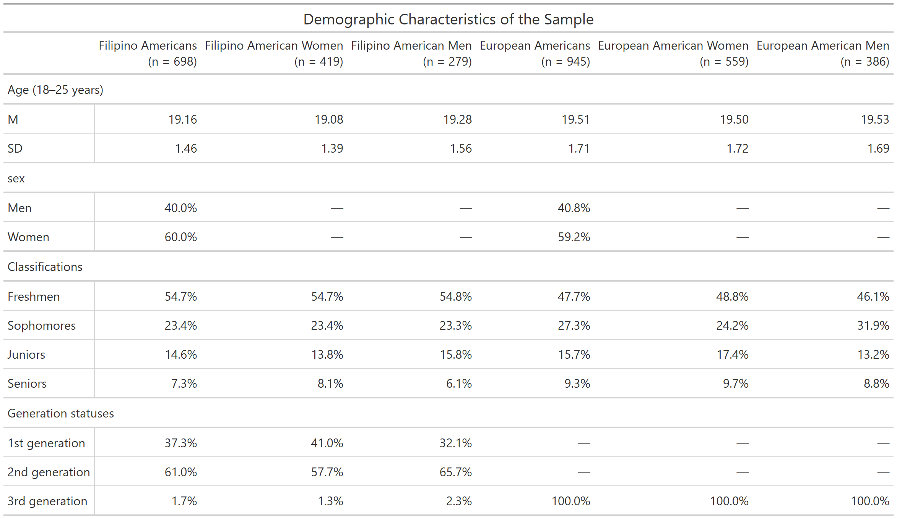

```

------------------------------------------------------------------------

## 3. Variable preparation and scale construction

This section documents all data preparation steps required prior to model estimation. Item-level variables are recoded to ensure consistent directionality, missing values are handled using prespecified rules, and composite scale scores are computed for use in descriptive, correlational, and validity analyses.

Specifically, reverse-coded CES-D items are transformed, and mean scores are calculated for the PHQ-8, generalized anxiety, perceived stress, and CES-D depressive symptom measures. Additional composite variables are constructed for brooding rumination, self-deprecation and positive esteem (derived from the Rosenberg Self-Esteem Scale), and overall quality of life. At the conclusion of this section, the dataset contains a finalized set of analytic variables that are used unchanged in all subsequent subgroup summaries, confirmatory factor analyses, measurement invariance models, and correlational validity analyses.

**Scale construction and composite variable creation**

```{r}
#| label: scale_construction_phq_related
#| echo: true
#| warning: false
#| message: false

# Recode CES-D items

phq_total$cesd12r <- 3 - phq_total$cesd12
phq_total$cesd16r <- 3 - phq_total$cesd16

# Scale scores for PHQ, GAD, Perceived Stress, and CESD

phq_total$phq_mean <- rowMeans(subset(phq_total, select = c(phq1:phq8)), na.rm = TRUE)

phq_total$gad_mean <- rowMeans(subset(phq_total, select = c(gad1:gad7)), na.rm = TRUE)

phq_total$stress_mean <- rowMeans(subset(phq_total, select = c(stress1:stress10)), na.rm = TRUE)

phq_total$cesd_mean <- rowMeans(
subset(
phq_total,
select = c(cesd6:cesd11, cesd14:cesd15, cesd18:cesd20, cesd12r, cesd16r)
),
na.rm = TRUE
)

# Brooding rumination: rum1 rum3 rum6 rum7 rum8

phq_total$brood_mean <- rowMeans(
subset(phq_total, select = c(rum1, rum3, rum6, rum7, rum8)),
na.rm = TRUE
)

# Self-deprecation: Esteem1 Esteem2 Esteem5 Esteem9 Esteem10

phq_total$selfdep_mean <- rowMeans(
subset(phq_total, select = c(Esteem1, Esteem2, Esteem5, Esteem9, Esteem10)),
na.rm = TRUE
)

# Positive esteem: Esteem3 Esteem4 Esteem6 Esteem7 Esteem8

phq_total$posesteem_mean <- rowMeans(
subset(phq_total, select = c(Esteem3, Esteem4, Esteem6, Esteem7, Esteem8)),
na.rm = TRUE
)

# Keep only analysis variables needed downstream

phq_total <- phq_total %>%
select(
classification,
female,
age,
filipino,
genstat,
phq1:phq8,
phq_mean,
gad_mean,
stress_mean,
cesd_mean,
brood_mean,
selfdep_mean,
posesteem_mean,
qol
)

```

------------------------------------------------------------------------

## 4. Group definitions and descriptive input computation

This section defines the analytic subgroups used throughout the confirmatory factor and measurement invariance analyses and prepares the subgroup-specific PHQ-8 item datasets that are used consistently across descriptive summaries, correlation estimation, and CFA modeling. Participants are classified based on ethnicity and sex to support comparisons between Filipino American and European American respondents, as well as between men and women within each population. Human-readable factor labels are applied for reporting consistency across later sections of the workflow.

For each subgroup, item-level means and standard deviations are computed from the same PHQ-8 item responses that are later supplied to the CFA models. These descriptive statistics are generated as part of the reproducible pipeline and are not presented as a separate standalone table. Instead, they are stored and subsequently combined with the subgroup-specific polychoric correlation matrices estimated in the CFA section to construct the correlation–descriptive tables used to cross-validate the manuscript tables.

In this section, the output consists of subgroup-specific data objects and a structured list of item-level descriptive statistics (`all_stats`), which are carried forward and merged with the lavaan-estimated correlation matrices when the combined tables are rendered later in the supplement.

**Analytic subgroups and variable labeling**

```{r}
#| label: subgroup-definitions
#| echo: true
#| message: false
#| warning: false

# Create ethnicity-by-sex grouping indicators and total-group flags
phq_total <- phq_total %>%
  mutate(
    Fil_Women   = ifelse(filipino == 1 & female == 1, 1, NA),
    Fil_Men     = ifelse(filipino == 1 & female == 0, 1, NA),
    EA_Women    = ifelse(filipino == 0 & female == 1, 1, NA),
    EA_Men      = ifelse(filipino == 0 & female == 0, 1, NA),

    # Ethnicity-only group indicators
    Fil_Amer    = ifelse(filipino == 1, 1, NA),
    Eur_Amer    = ifelse(filipino == 0, 1, NA),

    # Overall sex totals
    Total_Men   = ifelse(female == 0, 1, NA),
    Total_Women = ifelse(female == 1, 1, NA)
  )

# Working dataset for subgroup-specific analyses
phq_subs <- phq_total

# -------------------------------------------------------------------
# Factor labels for reporting
# -------------------------------------------------------------------

female_labels         <- c("Male", "Female")
classification_labels <- c("Freshman", "Sophomore", "Junior", "Senior")
genstat_labels        <- c("1st Generation", "2nd Generation", "3rd Generation")

# Apply human-readable factor labels
phq_subs$female         <- factor(phq_subs$female, levels = c(0, 1), labels = female_labels)
phq_subs$classification <- factor(phq_subs$classification, levels = 1:4, labels = classification_labels)
phq_subs$genstat        <- factor(phq_subs$genstat, levels = 1:3, labels = genstat_labels)

# -------------------------------------------------------------------
# Define subgroup-specific PHQ-8 item datasets
# (used consistently across descriptives, correlations, and CFA models)
# -------------------------------------------------------------------

# Filipino American women / men
subset_fw <- phq_subs %>%
  filter(Fil_Women == 1) %>%
  select(phq1:phq8)

subset_fm <- phq_subs %>%
  filter(Fil_Men == 1) %>%
  select(phq1:phq8)

# European American women / men
subset_ew <- phq_subs %>%
  filter(EA_Women == 1) %>%
  select(phq1:phq8)

subset_em <- phq_subs %>%
  filter(EA_Men == 1) %>%
  select(phq1:phq8)

# Ethnicity totals
subset_fa <- phq_subs %>%
  filter(Fil_Amer == 1) %>%
  select(phq1:phq8)

subset_ea <- phq_subs %>%
  filter(Eur_Amer == 1) %>%
  select(phq1:phq8)

# Overall men / women totals
subset_total_men <- phq_subs %>%
  filter(Total_Men == 1) %>%
  select(phq1:phq8)

subset_total_women <- phq_subs %>%
  filter(Total_Women == 1) %>%
  select(phq1:phq8)

```

**Item-level descriptive statistics by subgroup**

Item-level means and standard deviations are computed from the same subgroup-specific item responses used for CFA estimation and are reported alongside the polychoric correlation matrices extracted from the lavaan estimation inputs. Descriptive statistics are therefore presented within the correlation tables rather than as a separate standalone table.

```{r}
#| label: descriptives-item-means-sds
#| echo: true
#| message: false
#| warning: false

# Function to compute item-level means and standard deviations
calculate_stats <- function(data) {
  means <- sapply(data, mean, na.rm = TRUE)
  sds   <- sapply(data, sd,   na.rm = TRUE)

  list(
    means = means,
    sds   = sds
  )
}

# -------------------------------------------------------------------
# Compute descriptive statistics for each analytic subgroup
# -------------------------------------------------------------------

stats_fw         <- calculate_stats(subset_fw)
stats_fm         <- calculate_stats(subset_fm)
stats_ew         <- calculate_stats(subset_ew)
stats_em         <- calculate_stats(subset_em)
stats_fa         <- calculate_stats(subset_fa)
stats_ea         <- calculate_stats(subset_ea)
stats_total_men  <- calculate_stats(subset_total_men)
stats_total_women<- calculate_stats(subset_total_women)

# -------------------------------------------------------------------
# Store subgroup descriptive statistics in a named list
# (used later when constructing combined correlation–descriptive tables)
# -------------------------------------------------------------------

all_stats <- list(
  Filipino_Women      = stats_fw,
  Filipino_Men        = stats_fm,
  EA_Women            = stats_ew,
  EA_Men              = stats_em,
  Filipino_Americans  = stats_fa,
  European_Americans  = stats_ea,
  Total_Men           = stats_total_men,
  Total_Women         = stats_total_women
)

```

------------------------------------------------------------------------

## 5. Confirmatory factor analytic models

> **Correspondence to manuscript.** 
>
> Outputs in this section reproduce the CFA model fit indices, standardized factor loadings, factor correlations, and McDonald’s omega reliability estimates reported in Tables 2–6 of the manuscript. CFA models in this section are estimated using polychoric correlations for ordinal indicators under WLSMV estimation.

A series of confirmatory factor analytic (CFA) models were estimated to evaluate competing latent structures of the PHQ-8 using ordinal item indicators. All models were estimated separately across analytic subgroups to assess the stability of the factor structure across ethnicity and sex. Model fit indices, standardized factor loadings, and factor correlations are reported for each specification.

------------------------------------------------------------------------

### 5.1 One-factor model

The one-factor model specifies a single latent depression factor underlying all eight PHQ-8 items. This model serves as the baseline representation of PHQ-8 dimensionality and provides a reference point for evaluating alternative factor structures. Model fit statistics, standardized factor loadings, and item correlations are examined across all analytic subgroups.

**Diagram of the one-factor PHQ-8 measurement model.**

```{r}
#| label: cfa-diagram-onefactor
#| echo: true
#| message: false
#| warning: false

# -------------------------------------------------------------------
# Diagram code for one-factor PHQ-8 model
# -------------------------------------------------------------------

diagram_code_onefactor <- "
digraph {

  # Graph properties
  label = 'One Factor Model of the PHQ-8'
  graph [ranksep = .3]

  # Observed indicators
  node [shape = box]
  phq1;
  phq2;
  phq3;
  phq4;
  phq5;
  phq6;
  phq7;
  phq8;

  # Latent factor
  node [shape = circle]
  depression;

  # Factor loadings
  edge [minlen = 3.5]
  depression -> phq1
  depression -> phq2
  depression -> phq3
  depression -> phq4
  depression -> phq5
  depression -> phq6
  depression -> phq7
  depression -> phq8
}
"

# Build DiagrammeR graph object
onefactor_graph <- DiagrammeR::grViz(diagram_code_onefactor)

# Ensure static PNG exists for PDF output
svg_txt <- DiagrammeRsvg::export_svg(onefactor_graph)
rsvg::rsvg_png(
  charToRaw(svg_txt),
  file = "figures/cfa_onefactor_phq8.png"
)

# -------------------------------------------------------------------
# Format-specific rendering
# -------------------------------------------------------------------

if (knitr::is_html_output()) {

  # HTML / IDE preview: interactive DiagrammeR widget
  onefactor_graph

} else if (knitr::is_latex_output()) {

  # PDF (and other LaTeX-based outputs): use static image
  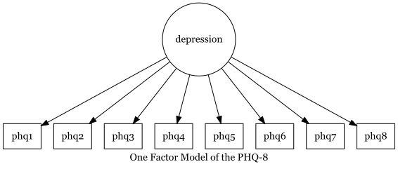

} else {

  # Fallback for other formats
  onefactor_graph
}

```

**One-factor CFA model (estimated separately by subgroup)**

::: callout-note
#### Syntax scaffolding: One-factor CFA models in lavaan

- Goal. This chunk estimates a single-factor CFA model for the PHQ-8 and reproduces the fit indices and loadings for the one-factor model reported in Tables 2–4.

- Model specification (lavaan).\
  The object `phq_cfa_model` is a character string in lavaan model syntax defining one latent factor (`dep`) with indicators `phq1`–`phq8`, written in the form `dep =~ phq1 + phq2 + … + phq8`.

- This syntax is passed directly to `lavaan::cfa()`.

  - Estimator and parameterization.\
    The helper function `run_cfa()` calls `lavaan::cfa()` with:

    - `ordered = c("phq1", ..., "phq8")` so that all PHQ items are treated as ordinal indicators.

    - `estimator = "WLSMV"` to match the manuscript (DWLS with robust corrections; recommended for ordinal items).

    - `parameterization = "theta"` to use the THETA parameterization, which expresses residual variances directly and matches the parameterization used throughout this supplement

  - Subgroup estimation.\
    The calls

  - fit_total \<- run_cfa(...) fit_total_men \<- run_cfa(subset_total_men) fit_total_women \<- run_cfa(subset_total_women)

  - run the *same* CFA model separately for each analytic subgroup (total sample, Filipino Americans, European Americans, and sex-specific subsamples).

  - Fit indices.\
    The object `CFA_summary` is built by calling `lavaan::fitMeasures()` on each fitted object (e.g., `fit_total`, `fit_fa`), extracting:

    - Number of parameters (`"npar"`), χ² and df (`"chisq"`, `"df"`), p-value (`"pvalue"`),

    - Global fit indices (e.g., `"cfi"`, `"tli"`, `"rmsea"`, `"srmr"`).\
      These are then assembled into a data frame and formatted using `gt::gt()` for reporting.

  - Software dependencies.

    - lavaan: `cfa()`, `fitMeasures()`

    - dplyr (via `%>%`), stats (base R functions), and gt for table formatting.
:::

```{r}
#| label: cfa-onefactor-fit
#| echo: true
#| message: false
#| warning: false
#| eval: true

# -------------------------------------------------------------------
# One-factor PHQ-8 CFA model (ordinal indicators; WLSMV estimator, THETA)
# -------------------------------------------------------------------

phq_cfa_model <- "
  dep =~ phq1 + phq2 + phq3 + phq4 +
         phq5 + phq6 + phq7 + phq8
"

run_cfa <- function(data) {
  cfa(
    model           = phq_cfa_model,
    data            = data,
    ordered         = c('phq1','phq2','phq3','phq4',
                        'phq5','phq6','phq7','phq8'),
    estimator       = "WLSMV",
    parameterization = "theta"
  )
}

# Total analytic sample
fit_total <- run_cfa(
  phq_subs %>%
    select(phq1:phq8)
)

# Subgroup models
fit_total_men   <- run_cfa(subset_total_men)
fit_total_women <- run_cfa(subset_total_women)

fit_fm <- run_cfa(subset_fm)
fit_fw <- run_cfa(subset_fw)

fit_em <- run_cfa(subset_em)
fit_ew <- run_cfa(subset_ew)

fit_fa <- run_cfa(subset_fa)
fit_ea <- run_cfa(subset_ea)

```

**Model fit indices for the one-factor PHQ-8 model across subgroups.**

**Fit index reporting policy.** All fit indices reproduced in this supplement are extracted directly from the lavaan `fitMeasures()`output for models estimated using WLSMV with ordered indicators under THETA parameterization.

```{r}
#| label: cfa-onefactor-fit-data
#| echo: true
#| message: false
#| warning: false

# Collect one-factor CFA fit indices across analytic subgroups
CFA_summary <- data.frame(
  Model = c(
    "Total Sample",
    "Total Men",
    "Total Women",
    "Filipino Americans",
    "Filipino American Men",
    "Filipino American Women",
    "European Americans",
    "European American Men",
    "European American Women"
  ),
  Par = c(
    fitMeasures(fit_total,       "npar"),
    fitMeasures(fit_total_men,   "npar"),
    fitMeasures(fit_total_women, "npar"),
    fitMeasures(fit_fa,          "npar"),
    fitMeasures(fit_fm,          "npar"),
    fitMeasures(fit_fw,          "npar"),
    fitMeasures(fit_ea,          "npar"),
    fitMeasures(fit_em,          "npar"),
    fitMeasures(fit_ew,          "npar")
  ),
  ChiSq = c(
    fitMeasures(fit_total,       "chisq"),
    fitMeasures(fit_total_men,   "chisq"),
    fitMeasures(fit_total_women, "chisq"),
    fitMeasures(fit_fa,          "chisq"),
    fitMeasures(fit_fm,          "chisq"),
    fitMeasures(fit_fw,          "chisq"),
    fitMeasures(fit_ea,          "chisq"),
    fitMeasures(fit_em,          "chisq"),
    fitMeasures(fit_ew,          "chisq")
  ),
  df = c(
    fitMeasures(fit_total,       "df"),
    fitMeasures(fit_total_men,   "df"),
    fitMeasures(fit_total_women, "df"),
    fitMeasures(fit_fa,          "df"),
    fitMeasures(fit_fm,          "df"),
    fitMeasures(fit_fw,          "df"),
    fitMeasures(fit_ea,          "df"),
    fitMeasures(fit_em,          "df"),
    fitMeasures(fit_ew,          "df")
  ),
  p_value = c(
    fitMeasures(fit_total,       "pvalue"),
    fitMeasures(fit_total_men,   "pvalue"),
    fitMeasures(fit_total_women, "pvalue"),
    fitMeasures(fit_fa,          "pvalue"),
    fitMeasures(fit_fm,          "pvalue"),
    fitMeasures(fit_fw,          "pvalue"),
    fitMeasures(fit_ea,          "pvalue"),
    fitMeasures(fit_em,          "pvalue"),
    fitMeasures(fit_ew,          "pvalue")
  ),
  CFI = c(
    fitMeasures(fit_total,       "cfi"),
    fitMeasures(fit_total_men,   "cfi"),
    fitMeasures(fit_total_women, "cfi"),
    fitMeasures(fit_fa,          "cfi"),
    fitMeasures(fit_fm,          "cfi"),
    fitMeasures(fit_fw,          "cfi"),
    fitMeasures(fit_ea,          "cfi"),
    fitMeasures(fit_em,          "cfi"),
    fitMeasures(fit_ew,          "cfi")
  ),
  SRMR = c(
    fitMeasures(fit_total,       "srmr"),
    fitMeasures(fit_total_men,   "srmr"),
    fitMeasures(fit_total_women, "srmr"),
    fitMeasures(fit_fa,          "srmr"),
    fitMeasures(fit_fm,          "srmr"),
    fitMeasures(fit_fw,          "srmr"),
    fitMeasures(fit_ea,          "srmr"),
    fitMeasures(fit_em,          "srmr"),
    fitMeasures(fit_ew,          "srmr")
  ),
  stringsAsFactors = FALSE
)

# Format fit statistics for reporting
CFA_summary_print <-
  CFA_summary %>%
  dplyr::mutate(
    ChiSq  = round(ChiSq, 2),
    CFI    = round(CFI, 3),
    SRMR   = round(SRMR, 3),
    p_value = ifelse(
      p_value < 0.001,
      "<.001",
      sprintf("%.3f", p_value)
    )
  )

# Build gt table object
CFA_summary_table <-
  CFA_summary_print %>%
  gt::gt() %>%
  gt::cols_label(
    Model   = "Model",
    Par     = "Par",
    ChiSq   = "ChiSq",
    df      = gt::md("*df*"),
    p_value = gt::md("*p-value*"),
    CFI     = "CFI",
    SRMR    = "SRMR"
  ) %>%
  gt::tab_header(
    title = "Fit Statistics for the One-Factor PHQ-8 Model"
  )

```

> **Note on correspondence to manuscript tables.**
>
> The fit indices reported in this table reproduce the numerical values used in the manuscript CFA results. The table formatting here is optimized for reproducibility and inspection of the analytic workflow, rather than for publication layout. The manuscript versions of these tables present the same values in a condensed, publication-formatted structure.

**Render the one-factor PHQ-8 CFA model fit indices for all analytic groups in HTML, and export a high-resolution PNG version for inclusion in the PDF.**

```{r}
#| label: cfa-onefactor-fit-table-html
#| echo: true
#| message: false
#| warning: false
#| eval: !expr knitr::is_html_output()

CFA_summary_table

gt::gtsave(
  data     = CFA_summary_table,
  filename = "table4_onefactor_cfa_fit.png",
  path     = "tables",
  zoom     = 2
)

```

**Insert the saved one-factor PHQ-8 CFA fit table image into the PDF version of the supplement.**

```{r}
#| label: cfa-onefactor-fit-table-pdf
#| echo: true
#| message: false
#| warning: false
#| eval: !expr knitr::is_latex_output()
#| fig-align: "center"


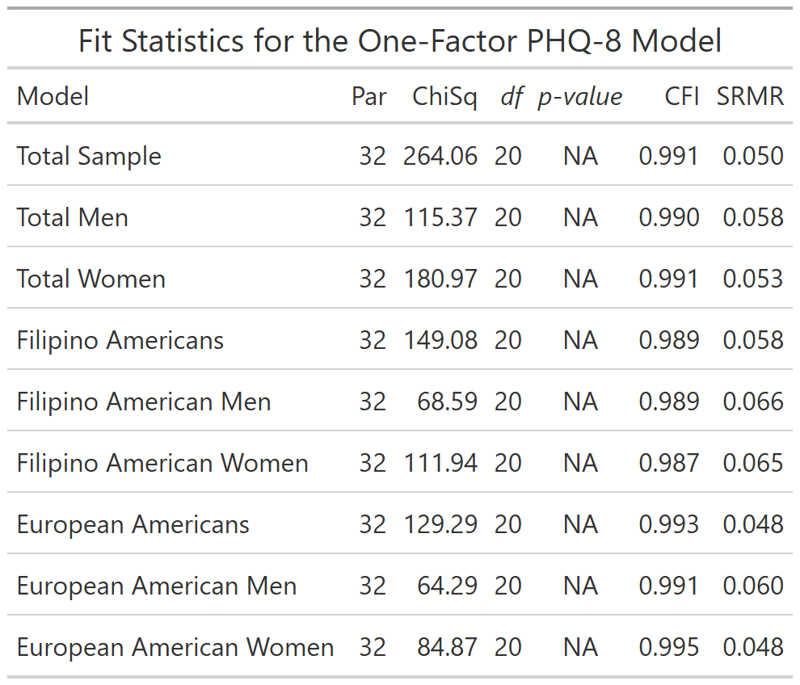

```

**Extract PHQ-8 item correlation matrices and construct reproducible correlation–descriptive tables**

Polychoric correlation matrices are computed for each analytic subgroup to match the association structure used in the CFA models estimated with ordinal indicators in *lavaan* under WLSMV. These matrices represent the exact correlation inputs supplied to the CFA estimation process and are reproduced here to support transparency and numerical reproducibility.

Item-level means and standard deviations, based on the same subgroup-specific PHQ-8 item responses described in Section 4, are appended to the corresponding subgroup polychoric correlation matrices when constructing the correlation–descriptive tables. In practice, the table-building function recomputes these summaries from the subgroup item datasets passed into it, ensuring that the descriptive statistics remain synchronized with the correlation inputs used for CFA estimation. The resulting tables are used to cross-validate the values reported in the manuscript; while their visual formatting differs from the publication tables, they reproduce the underlying numerical estimates exactly.

The subgroup mapping and table-construction functions below pair (a) the polychoric correlation matrices used in CFA estimation with (b) the observed item means and standard deviations computed from the same item datasets, and generate report-ready tables for archival, verification, and supplement display.

```{r}
#| label: corr-polychoric-subgroups
#| echo: true
#| message: false
#| warning: false

# -------------------------------------------------------------------
# Define PHQ-8 indicator set used in CFA estimation
# -------------------------------------------------------------------

phq_items <- paste0("phq", 1:8)

# Assemble subgroup-specific PHQ-8 item matrices
correlations_list <- list(
  Filipino_Americans = subset_fa[, phq_items],
  European_Americans = subset_ea[, phq_items],
  Total_Men          = subset_total_men[, phq_items],
  Total_Women        = subset_total_women[, phq_items],
  Filipino_Men       = subset_fm[, phq_items],
  Filipino_Women     = subset_fw[, phq_items],
  EA_Men             = subset_em[, phq_items],
  EA_Women           = subset_ew[, phq_items]
)

# -------------------------------------------------------------------
# Compute polychoric correlations for each analytic subgroup
# (matches the association structure used in WLSMV CFA estimation)
# -------------------------------------------------------------------

correlations_list <- lapply(
  correlations_list,
  function(df) psych::polychoric(df)$rho
)

```

**PHQ-8 polychoric correlation matrices by analytic subgroup.**

Define subgroup-specific item datasets for correlation–descriptive table construction.

This mapping links each analytic subgroup to the corresponding item-level PHQ-8 responses used to compute observed item means and standard deviations. These subgroup datasets are paired with the subgroup-specific polychoric correlation matrices used in CFA estimation to produce combined correlation–descriptive tables..

```{r}
#| label: subgroup-item-dataset-map
#| echo: true
#| message: false
#| warning: false

# Mapping of analytic subgroup names to the corresponding PHQ-8 item datasets
# (used when constructing combined correlation–descriptive tables)

subset_map <- list(
  Filipino_Americans = subset_fa,
  European_Americans = subset_ea,
  Total_Men          = subset_total_men,
  Total_Women        = subset_total_women,
  Filipino_Men       = subset_fm,
  Filipino_Women     = subset_fw,
  EA_Men             = subset_em,
  EA_Women           = subset_ew
)
```

**Construct combined polychoric correlation tables with observed item means and standard deviations.**

This function formats subgroup-specific PHQ-8 polychoric correlation matrices used in CFA estimation and appends observed item means and standard deviations computed from the same subgroup item responses. The resulting tables present all descriptive inputs underlying CFA estimation in a single, report-ready format.

```{r}
#| label: corr-desc-table-function
#| echo: true
#| message: false
#| warning: false

# Construct a PHQ-8 table combining polychoric correlations with item means and SDs
make_corr_desc_gt <- function(corr_mat, item_data, title_text) {

  # -----------------------------------------------------------------
  # Prepare correlation matrix (lower-triangular display only)
  # -----------------------------------------------------------------
  corr_mat <- as.matrix(corr_mat)
  colnames(corr_mat) <- toupper(colnames(corr_mat))
  rownames(corr_mat) <- toupper(rownames(corr_mat))

  corr_disp <- round(corr_mat, 2)
  corr_disp[upper.tri(corr_disp, diag = FALSE)] <- NA

  # -----------------------------------------------------------------
  # Compute item means and standard deviations
  # -----------------------------------------------------------------
  item_data <- as.data.frame(item_data)
  names(item_data) <- toupper(names(item_data))

  item_means <- round(sapply(item_data, mean, na.rm = TRUE), 2)
  item_sds   <- round(sapply(item_data, sd,   na.rm = TRUE), 2)

  # Base data frame from correlation matrix
  df <- as.data.frame(corr_disp)
  df <- tibble::rownames_to_column(df, var = "PHQ Item")

  # Build Mean / SD rows as single-row data frames with matching columns
  mean_row <- as.data.frame(as.list(item_means[colnames(corr_disp)]))
  sd_row   <- as.data.frame(as.list(item_sds[colnames(corr_disp)]))

  mean_row <- tibble::add_column(mean_row, `PHQ Item` = "Mean", .before = 1)
  sd_row   <- tibble::add_column(sd_row,   `PHQ Item` = "SD",   .before = 1)

  # Append Mean and SD rows to the correlation matrix
  df <- dplyr::bind_rows(df, mean_row, sd_row)

  # Ensure numeric columns are treated as numeric for formatting
  num_cols <- setdiff(names(df), "PHQ Item")
  df[num_cols] <- lapply(df[num_cols], as.numeric)

  # -----------------------------------------------------------------
  # Format combined correlation–descriptive table with gt
  # -----------------------------------------------------------------
  gt(df) %>%
    cols_label(`PHQ Item` = "PHQ Items") %>%

# Enforce consistent table width & alignment (older gt-compatible)
tab_options(
  table.width = "100%"
) %>%
cols_align(
  align = "center",
  columns = everything()
) %>%


    fmt_number(columns = all_of(num_cols), decimals = 2) %>%
    fmt_missing(columns = all_of(num_cols), missing_text = "") %>%
    tab_header(title = title_text)
}

```

**Generate subgroup-specific PHQ-8 correlation–descriptive tables.**

For each analytic subgroup, the polychoric correlation matrix is combined with the observed item means and standard deviations to produce a complete descriptive summary aligned with the CFA estimation inputs.

```{r}
#| label: corr-desc-generate-tables
#| echo: true
#| message: false
#| warning: false
#| results: "hide"

corr_desc_tables <- purrr::imap(
  correlations_list,
  ~ make_corr_desc_gt(
      corr_mat   = .x,
      item_data  = subset_map[[.y]],
      title_text = paste0(
        "PHQ-8 Polychoric Correlations with Item Means and SDs: ",
        .y
      )
    )
)


```

**Save correlation–descriptive tables as high-resolution image files.**

Each subgroup-specific table is exported as a PNG file for archival or review purposes. Files are written to the `tables/`directory at high resolution to ensure readability in PDF outputs.

```{r}
#| label: corr-desc-save-tables
#| echo: true
#| message: false
#| warning: false
#| results: "hide"

purrr::iwalk(corr_desc_tables, ~ {

  safe_name <- gsub("[^A-Za-z0-9_]+", "_", .y)

  gt::gtsave(
    .x,
    filename = paste0(safe_name, "_PHQ8_corr_means_sds.png"),
    path     = "tables",
    zoom     = 2
  )
})

invisible(NULL)


```

> **Manuscript correspondence and purpose of this table.**
>
> The polychoric correlations, means, and standard deviations reproduced here correspond to the descriptive statistics and validity associations summarized in the manuscript tables. In this supplement, the table is rendered in a code-forward format to document the exact values generated by the analytic pipeline and to support numerical reproducibility. The publication tables present these same numerical values in a typeset layout; the versions shown here may differ in appearance, but they reproduce the underlying estimates exactly.

**Display correlation–descriptive tables in the HTML output.**

For interpretive convenience, subgroup-specific tables are also rendered directly in the HTML output so that correlations and descriptive statistics can be reviewed inline.

```{r}
#| label: corr-desc-render-html
#| echo: true
#| message: false
#| warning: false
#| results: 'asis'

if (knitr::is_html_output()) {

  purrr::walk(corr_desc_tables, function(tab) {

    gt_data <- tab[["_data"]]

    # skip empty tables
    if (is.null(gt_data) || nrow(gt_data) == 0) return(NULL)

    # prefer as_raw_html() when available
    if (utils::packageVersion("gt") >= "0.10.0") {
      html_out <- gt::as_raw_html(tab)
    } else {
      # fallback for older gt builds
      html_out <- as.character(gt:::as.tags.gt_tbl(tab))
    }

    # emit raw HTML into the document
    cat(html_out, "\n\n")
  })
}

```

**Insert the saved polychoric correlation tables (with means and standard deviations) into the PDF version of the supplement.**

```{r}
#| label: corr-desc-render-pdf
#| echo: true
#| message: false
#| warning: false
#| eval: !expr knitr::is_latex_output()
#| fig-align: "center"
#| out-width: "100%"

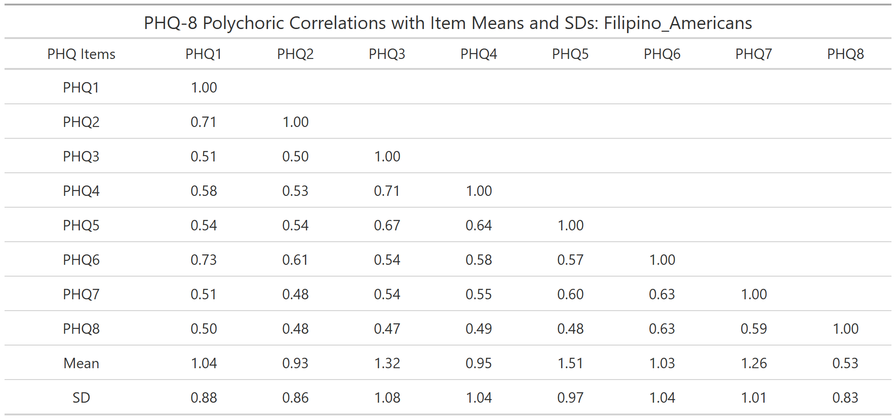
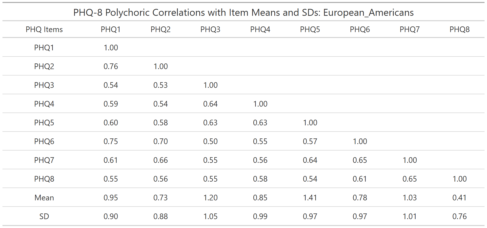
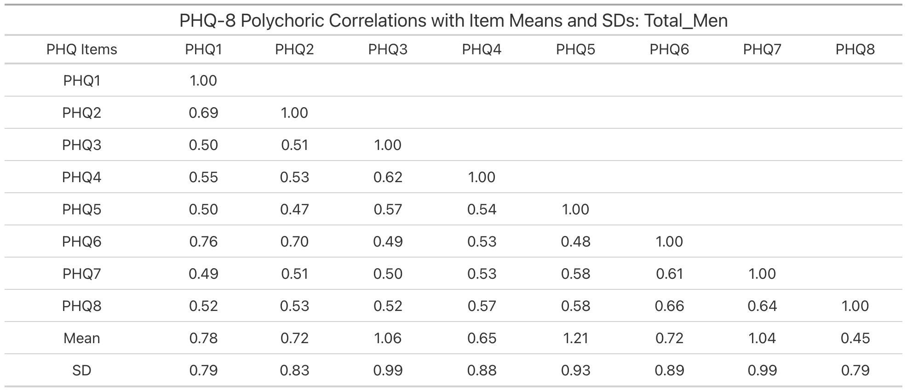
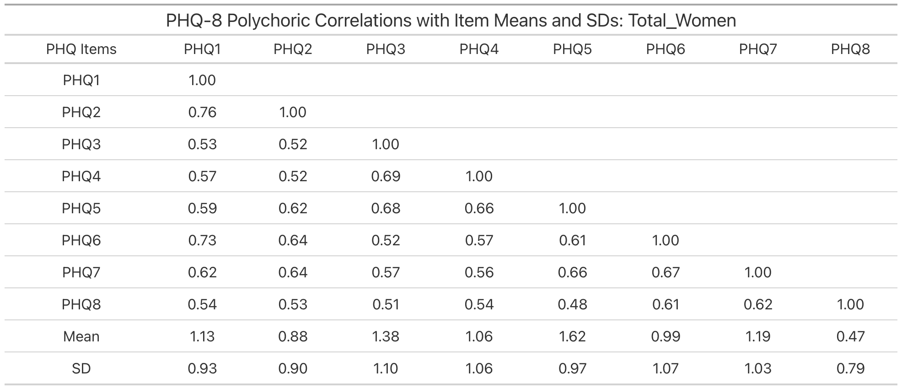
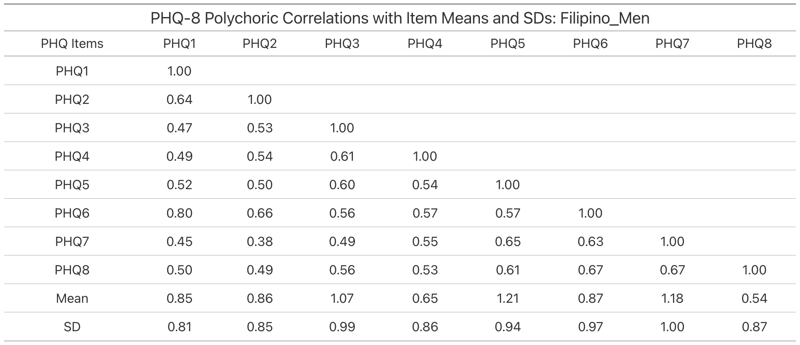
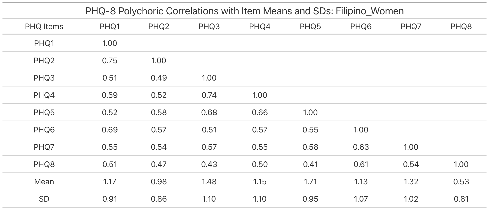
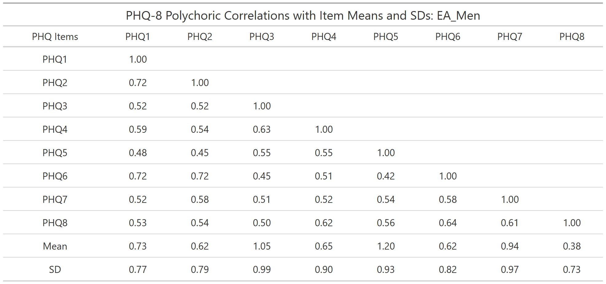
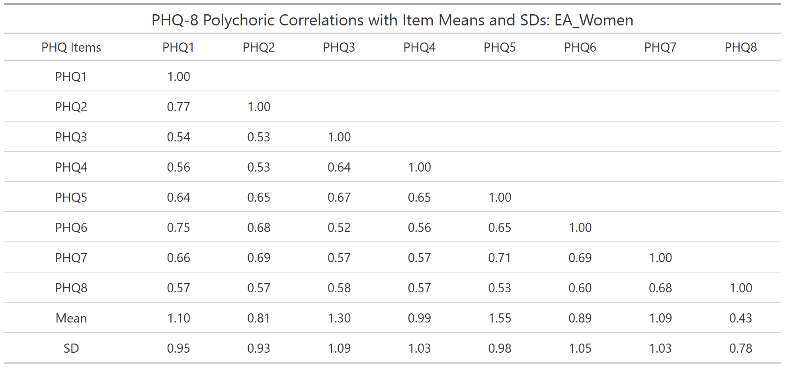

```

**Standardized factor loadings for the one-factor PHQ-8 model by subgroup.**

Standardized factor loadings are reported to summarize the strength of association between each PHQ-8 item and the latent depression factor across analytic subgroups. Loadings are extracted from the lavaan standardized solution for the one-factor CFA model estimated with ordinal indicators. Consistency in loading magnitudes across groups provides evidence for the stability of the unidimensional structure.

```{r}
#| label: onefactor-loadings-build
#| echo: true
#| message: false
#| warning: false

# --- loading + omega functions ---

get_loadings <- function(fit, group_label) {
  pe <- parameterEstimates(fit, standardized = TRUE)
  pe <- pe[pe$op == "=~" & pe$lhs == "dep", c("rhs","std.all")]
  data.frame(
    Item    = toupper(pe$rhs),
    Group   = group_label,
    Loading = pe$std.all,
    stringsAsFactors = FALSE
  )
}

compute_omega_dep <- function(fit) {
  pe <- parameterEstimates(fit, standardized = TRUE)
  load <- pe[pe$op=="=~" & pe$lhs=="dep","std.all"]
  items <- pe[pe$op=="=~" & pe$lhs=="dep","rhs"]
  theta <- pe[pe$op=="~~" & pe$lhs %in% items & pe$lhs==pe$rhs,"std.all"]
  (sum(load)^2) / ((sum(load)^2) + sum(theta))
}

get_omega_row <- function(fit, group_label) {
  data.frame(Item="Omega", Group=group_label,
             Loading=compute_omega_dep(fit))
}

# --- collect loadings ---

loadings_long <- rbind(
  get_loadings(fit_total_men,   "Total Men"),
  get_loadings(fit_total_women, "Total Women"),
  get_loadings(fit_fm,          "Filipino American Men"),
  get_loadings(fit_fw,          "Filipino American Women"),
  get_loadings(fit_em,          "European American Men"),
  get_loadings(fit_ew,          "European American Women"),
  get_loadings(fit_fa,          "Filipino Americans"),
  get_loadings(fit_ea,          "European Americans")
)

omegas_long <- rbind(
  get_omega_row(fit_total_men,   "Total Men"),
  get_omega_row(fit_total_women, "Total Women"),
  get_omega_row(fit_fm,          "Filipino American Men"),
  get_omega_row(fit_fw,          "Filipino American Women"),
  get_omega_row(fit_em,          "European American Men"),
  get_omega_row(fit_ew,          "European American Women"),
  get_omega_row(fit_fa,          "Filipino Americans"),
  get_omega_row(fit_ea,          "European Americans")
)

loadings_wide <- dplyr::bind_rows(loadings_long, omegas_long) %>%
  dplyr::mutate(Loading = round(Loading, 2)) %>%
  tidyr::pivot_wider(
    id_cols = Item,
    names_from = Group,
    values_from = Loading
  ) %>%
  dplyr::mutate(
    Item = factor(
      Item,
      levels = c("PHQ1","PHQ2","PHQ3","PHQ4",
                 "PHQ5","PHQ6","PHQ7","PHQ8","Omega")
    )
  ) %>%
  dplyr::arrange(Item)

# --- build gt object (shared) ---

one_factor_table_gt <- loadings_wide %>%
  gt::gt() %>%
  gt::tab_header(
    title = "Standardized Loadings and Omega for the One-Factor PHQ-8 Model"
  ) %>%
  gt::tab_spanner(
    label   = "Standardized Loadings (PHQ1–PHQ8) and Omega",
    columns = -Item
  )

```

> **Interpretation and manuscript correspondence.**
>
> The standardized factor loadings and McDonald’s ω values reproduced here correspond to the estimates reported in Tables 5 and 6 of the manuscript. The tables in this supplement are presented in a code-forward format to support transparent replication of the underlying estimates. The manuscript tables present the same numerical results in a typeset publication format.

**Render the one-factor PHQ-8 standardized factor loadings and McDonald’s omega estimates for all analytic groups in HTML, and export a high-resolution PNG version for inclusion in the PDF.**

```{r}
#| label: onefactor-loadings-html
#| echo: true
#| message: false
#| warning: false
#| eval: !expr knitr::is_html_output()

one_factor_table_gt

  gt::gtsave(
    data     = one_factor_table_gt,
    filename = "Table5_6_OneFactor_Loadings_Omega.png",
    path     = "tables",
    zoom     = 2
  )

```

**Insert the saved one-factor PHQ-8 standardized loadings and McDonald’s omega table image into the PDF version of the supplement.**

```{r}
#| label: onefactor-loadings-pdf
#| echo: true
#| message: false
#| warning: false
#| eval: !expr knitr::is_latex_output()
#| fig-align: "center"
#| out-width: "100%"

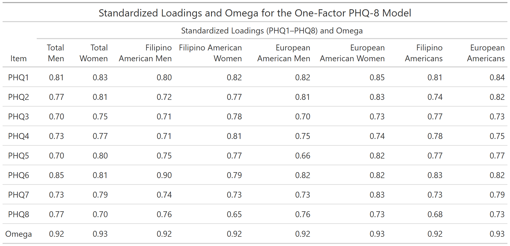


```

------------------------------------------------------------------------

### 5.2 Two-factor model A

The first two-factor specification partitions PHQ-8 items into cognitive-affective and somatic symptom domains based on commonly proposed conceptual distinctions. This model evaluates whether separating cognitive-affective and somatic content improves model fit relative to the unidimensional structure. Standardized factor loadings, factor correlations, and fit indices are reported for each analytic subgroup.

**In this specification, the cognitive-affective factor is indicated by items 1, 2, and 6–8, and the somatic factor is indicated by items 3–5.**

```{r}
#| label: cfa-diagram-twofactor-A
#| echo: true
#| message: false
#| warning: false

# -------------------------------------------------------------------
# Diagram code for Two-Factor Model A
# -------------------------------------------------------------------

diagram_code_twofactor_A <- "
digraph {

  label = 'Two Factor Model A of the PHQ-8 (Cognitive–Affective vs. Somatic factors)'
  graph [ranksep = .3]

  # Observed indicators
  node [shape = box]
  phq3;
  phq4;
  phq5;

  node [shape = box]
  phq1;
  phq2;
  phq6;
  phq7;
  phq8;

  # Latent factors
  node [shape = circle]
  Affective [label = 'Cognitive–Affective'];
  Somatic;

  # Factor loadings
  edge [minlen = 3.5]

  Affective -> phq1
  Affective -> phq2
  Affective -> phq6
  Affective -> phq7
  Affective -> phq8

  Somatic -> phq3
  Somatic -> phq4
  Somatic -> phq5

  # Correlated factors
  Affective -> Somatic [dir = both]
}
"

# Build DiagrammeR graph object
twofactor_A_graph <- DiagrammeR::grViz(diagram_code_twofactor_A)

# -------------------------------------------------------------------
# Ensure static PNG exists for PDF output
# -------------------------------------------------------------------

svg_txt <- DiagrammeRsvg::export_svg(twofactor_A_graph)
rsvg::rsvg_png(
  charToRaw(svg_txt),
  file = "figures/cfa_twofactor_modelA.png"
)

# -------------------------------------------------------------------
# Format-specific rendering
# -------------------------------------------------------------------

if (knitr::is_html_output()) {

  # HTML / IDE preview: interactive DiagrammeR widget
  twofactor_A_graph

} else if (knitr::is_latex_output()) {

  # PDF: use static PNG
  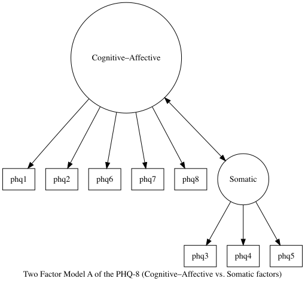

} else {

  # Fallback for other formats
  twofactor_A_graph
}

```

**Two-factor Model A CFA estimated separately across analytic subgroups.**

::: callout-note
#### Syntax scaffolding: Two-factor PHQ-8 CFA models (Models A and B)

- Goal. These chunks estimate two alternative two-factor CFA models (Model A and Model B) that partition PHQ-8 items into cognitive-affective (AFF) and somatic (SOM) factors, and reproduce Tables 5 and 6.

- Model specification (lavaan).

  - **Model A** defines the cognitive-affective factor using items 1, 2, and 6–8 and the somatic factor using items 3–5.
  - **Model B** defines the cognitive-affective factor using items 1, 2, and 6 and the somatic factor using items 3–5, 7, and 8.
  - Each specification is written as a lavaan model string (e.g., `phq_model_2A`, `phq_model_2B`) and passed into `lavaan::cfa()`.

- Estimation and subgroups.

  - As in the one-factor model, `cfa()` is called with `ordered` indicators, `estimator = "WLSMV"`, and `parameterization = "theta"`.
  - Separate fits are obtained for each analytic subgroup (total sample, Filipino Americans, European Americans, and sex-specific groups) by applying the two-factor model definitions to the subgroup data (e.g., `fit_2A_total`, `fit_2A_fa`, `fit_2B_ea`, etc.).

- Extracting loadings and factor correlations.\
  Standardized loadings and factor correlations are extracted from each fitted object using `lavaan::inspect()` and related accessors, reshaped with `dplyr` and `tidyr` into long and wide formats, and then stacked across subgroups.

- Computing McDonald’s omega.\
  The helper functions `compute_omega_factor_2A()` / `compute_omega_factor_2B()` and `get_omegas_2A()` / `get_omegas_2B()` derive McDonald’s ω for the Cognitive-Affective and Somatic factors by combining standardized loadings and residual variances from the lavaan object. The resulting omega values are:

  - Rounded with `round()`,
  - Converted to wide format with `tidyr::pivot_wider()`, and
  - Appended as an `"Omega"` row for each factor.

- Tabling.\
  The combined loadings-plus-omega tables (`loadings_2A_with_omega`, `loadings_2B_with_omega`) are formatted with:

  - `gt::gt()` to build the table,
  - `gt::tab_spanner()` and `gt::tab_header()` to add a descriptive spanner and title, matching the manuscript’s Tables 5–6.

- Software dependencies.

  - lavaan for CFA estimation and parameter extraction.
  - dplyr and tidyr for reshaping and combining subgroup results.
  - gt for publication-ready tables.
:::

```{r}
#| label: cfa-twofactor-A-fit
#| echo: true
#| message: false
#| warning: false
#| eval: true

# -------------------------------------------------------------------
# Two-Factor PHQ-8 CFA — Model A (WLSMV, THETA)
#   AFF = Cognitive-Affective items
#   SOM = Somatic items
# -------------------------------------------------------------------

phq_cfa_2A_model <- "
  AFF =~ phq1 + phq2 + phq6 + phq7 + phq8
  SOM =~ phq3 + phq4 + phq5
"

run_cfa_2A <- function(data) {
  cfa(
    model           = phq_cfa_2A_model,
    data            = data,
    ordered         = c('phq1','phq2','phq3','phq4',
                        'phq5','phq6','phq7','phq8'),
    estimator       = "WLSMV",
    parameterization = "theta"
  )
}

# Total analytic sample (Model A)
fit_2A_total <- run_cfa_2A(
  phq_subs %>%
    select(phq1:phq8)
)

# Subgroup models
fit_2A_total_men   <- run_cfa_2A(subset_total_men)
fit_2A_total_women <- run_cfa_2A(subset_total_women)

fit_2A_fm <- run_cfa_2A(subset_fm)
fit_2A_fw <- run_cfa_2A(subset_fw)

fit_2A_em <- run_cfa_2A(subset_em)
fit_2A_ew <- run_cfa_2A(subset_ew)

fit_2A_fa <- run_cfa_2A(subset_fa)
fit_2A_ea <- run_cfa_2A(subset_ea)


```

**Model fit indices for Two-factor Model A across subgroups.**

```{r}
#| label: cfa-twofactor-A-fit-table
#| echo: true
#| message: false
#| warning: false

# -------------------------------------------------------------------
# Collect Two-Factor Model A fit indices across analytic subgroups
# -------------------------------------------------------------------

CFA_2A_summary <- data.frame(
  Model = c(
    "Total Sample",
    "Total Men",
    "Total Women",
    "Filipino Americans",
    "Filipino American Men",
    "Filipino American Women",
    "European Americans",
    "European American Men",
    "European American Women"
  ),
  Par = c(
    fitMeasures(fit_2A_total,       "npar"),
    fitMeasures(fit_2A_total_men,   "npar"),
    fitMeasures(fit_2A_total_women, "npar"),
    fitMeasures(fit_2A_fa,          "npar"),
    fitMeasures(fit_2A_fm,          "npar"),
    fitMeasures(fit_2A_fw,          "npar"),
    fitMeasures(fit_2A_ea,          "npar"),
    fitMeasures(fit_2A_em,          "npar"),
    fitMeasures(fit_2A_ew,          "npar")
  ),
  ChiSq = c(
    fitMeasures(fit_2A_total,       "chisq"),
    fitMeasures(fit_2A_total_men,   "chisq"),
    fitMeasures(fit_2A_total_women, "chisq"),
    fitMeasures(fit_2A_fa,          "chisq"),
    fitMeasures(fit_2A_fm,          "chisq"),
    fitMeasures(fit_2A_fw,          "chisq"),
    fitMeasures(fit_2A_ea,          "chisq"),
    fitMeasures(fit_2A_em,          "chisq"),
    fitMeasures(fit_2A_ew,          "chisq")
  ),
  df = c(
    fitMeasures(fit_2A_total,       "df"),
    fitMeasures(fit_2A_total_men,   "df"),
    fitMeasures(fit_2A_total_women, "df"),
    fitMeasures(fit_2A_fa,          "df"),
    fitMeasures(fit_2A_fm,          "df"),
    fitMeasures(fit_2A_fw,          "df"),
    fitMeasures(fit_2A_ea,          "df"),
    fitMeasures(fit_2A_em,          "df"),
    fitMeasures(fit_2A_ew,          "df")
  ),
  p_value = c(
    fitMeasures(fit_2A_total,       "pvalue"),
    fitMeasures(fit_2A_total_men,   "pvalue"),
    fitMeasures(fit_2A_total_women, "pvalue"),
    fitMeasures(fit_2A_fa,          "pvalue"),
    fitMeasures(fit_2A_fm,          "pvalue"),
    fitMeasures(fit_2A_fw,          "pvalue"),
    fitMeasures(fit_2A_ea,          "pvalue"),
    fitMeasures(fit_2A_em,          "pvalue"),
    fitMeasures(fit_2A_ew,          "pvalue")
  ),
  CFI = c(
    fitMeasures(fit_2A_total,       "cfi"),
    fitMeasures(fit_2A_total_men,   "cfi"),
    fitMeasures(fit_2A_total_women, "cfi"),
    fitMeasures(fit_2A_fa,          "cfi"),
    fitMeasures(fit_2A_fm,          "cfi"),
    fitMeasures(fit_2A_fw,          "cfi"),
    fitMeasures(fit_2A_ea,          "cfi"),
    fitMeasures(fit_2A_em,          "cfi"),
    fitMeasures(fit_2A_ew,          "cfi")
  ),
  SRMR = c(
    fitMeasures(fit_2A_total,       "srmr"),
    fitMeasures(fit_2A_total_men,   "srmr"),
    fitMeasures(fit_2A_total_women, "srmr"),
    fitMeasures(fit_2A_fa,          "srmr"),
    fitMeasures(fit_2A_fm,          "srmr"),
    fitMeasures(fit_2A_fw,          "srmr"),
    fitMeasures(fit_2A_ea,          "srmr"),
    fitMeasures(fit_2A_em,          "srmr"),
    fitMeasures(fit_2A_ew,          "srmr")
  ),
  stringsAsFactors = FALSE
)

# -------------------------------------------------------------------
# Apply rounding and p-value formatting once (shared by HTML / PDF)
# -------------------------------------------------------------------

CFA_2A_summary_print <-
  CFA_2A_summary %>%
  dplyr::mutate(
    ChiSq   = round(ChiSq, 2),
    CFI     = round(CFI, 3),
    SRMR    = round(SRMR, 3),
    p_value = ifelse(
      p_value < 0.001,
      "<.001",
      sprintf("%.3f", p_value)
    )
  )

# -------------------------------------------------------------------
# Build gt table object (for HTML + image export)
# -------------------------------------------------------------------

gt_cfa_2A_summary <-
  CFA_2A_summary_print %>%
  gt::gt() %>%
  gt::cols_label(
    Model   = "Model",
    Par     = "Par",
    ChiSq   = "ChiSq",
    df      = gt::md("*df*"),
    p_value = gt::md("*p-value*"),
    CFI     = "CFI",
    SRMR    = "SRMR"
  ) %>%
  gt::tab_header(
    title = "Fit Statistics for the Two-Factor Model A"
  )

```

> **Note on correspondence to manuscript tables.**
>
> The fit indices reported in this table reproduce the numerical values used in the manuscript CFA results. The table formatting here is optimized for reproducibility and inspection of the analytic workflow, rather than for publication layout. The manuscript versions of these tables present the same values in a condensed, publication-formatted structure.

**Render the two-factor PHQ-8 CFA Model A fit indices for all analytic groups in HTML, and export a high-resolution PNG version for inclusion in the PDF.**

```{r}
#| label: cfa-twofactor-A-fit-table-html
#| echo: true
#| message: false
#| warning: false
#| eval: !expr knitr::is_html_output()

# Render the Model A fit table in HTML
gt_cfa_2A_summary

gt::gtsave(
  data     = gt_cfa_2A_summary,
  filename = "table4_twofactorA_cfa_fit.png",
  path     = "tables",
  zoom     = 2
)

```

**Insert the saved two-factor PHQ-8 CFA Model A fit table image into the PDF version of the supplement.**

```{r}
#| label: cfa-twofactor-A-fit-table-pdf
#| echo: true
#| message: false
#| warning: false
#| eval: !expr knitr::is_latex_output()
#| fig-align: "center"


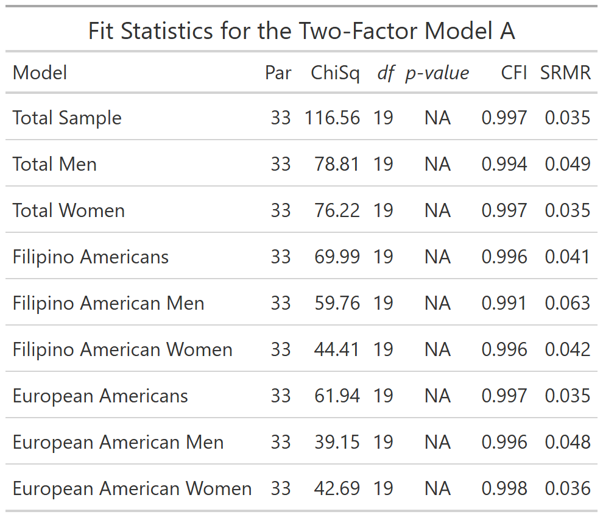

```

**Factor correlations for Two-factor Model A by subgroup.**

Standardized correlations between the cognitive-affective and somatic factors are reported to evaluate the degree of association between the two latent dimensions across analytic subgroups. Correlations are obtained from the lavaan standardized two-factor solution and reflect the latent factor associations estimated using ordinal indicators. The magnitude of these correlations provides evidence regarding the distinctiveness of the cognitive-affective and somatic dimensions.

```{r}
#| label: cfa-twofactor-A-factor-correlations
#| echo: true
#| message: false
#| warning: false

# -------------------------------------------------------------------
# Extract standardized latent factor correlations (AFF–SOM) for Model A
# -------------------------------------------------------------------

get_factor_corr_2A <- function(fit, sample_name) {
  cor_lv <- lavInspect(fit, "cor.lv")

  data.frame(
    Sample      = sample_name,
    Factor_1    = "AFF",
    Factor_2    = "SOM",
    Correlation = cor_lv["AFF", "SOM"],
    stringsAsFactors = FALSE
  )
}

CFA_2A_corr <- rbind(
  get_factor_corr_2A(fit_2A_total_men,   "Total Men"),
  get_factor_corr_2A(fit_2A_total_women, "Total Women"),
  get_factor_corr_2A(fit_2A_fm,          "Filipino American Men"),
  get_factor_corr_2A(fit_2A_fw,          "Filipino American Women"),
  get_factor_corr_2A(fit_2A_em,          "European American Men"),
  get_factor_corr_2A(fit_2A_ew,          "European American Women"),
  get_factor_corr_2A(fit_2A_fa,          "Filipino Americans"),
  get_factor_corr_2A(fit_2A_ea,          "European Americans")
)

# Round correlations once, shared by HTML and PDF
CFA_2A_corr_print <- CFA_2A_corr %>%
  dplyr::mutate(Correlation = round(Correlation, 2))

# -------------------------------------------------------------------
# Build gt table object (for HTML + interactive view)
# -------------------------------------------------------------------

gt_cfa_2A_corr <- CFA_2A_corr_print %>%
  gt::gt() %>%
  gt::cols_label(
    Sample      = "Sample",
    Factor_1    = "Factor 1",
    Factor_2    = "Factor 2",
    Correlation = "Correlation"
  ) %>%
  gt::tab_header(
    title = "Standardized Factor Correlations for Two-Factor Model A of the PHQ-8"
  )

```

**Render the two-factor PHQ-8 CFA Model A latent factor correlations for all analytic groups in HTML, and export a high-resolution PNG version for inclusion in the PDF.**

```{r}
#| label: cfa-twofactor-A-factor-correlations-html
#| echo: true
#| message: false
#| warning: false
#| eval: !expr knitr::is_html_output()

# HTML: show the gt table in the supplement
gt_cfa_2A_corr

# Save as supplementary CFA output (not part of a manuscript table)
gt::gtsave(
  data     = gt_cfa_2A_corr,
  filename = "cfa_twofactorA_factor_correlations.png",
  path     = "tables",
  zoom     = 2
)

```

**Insert the saved two-factor PHQ-8 CFA Model A latent factor correlation table image into the PDF version of the supplement.**

```{r}
#| label: cfa-twofactor-A-factor-correlations-pdf
#| echo: true
#| message: false
#| warning: false
#| eval: !expr knitr::is_latex_output()
#| fig-align: "center"
#| out-width: "100%"

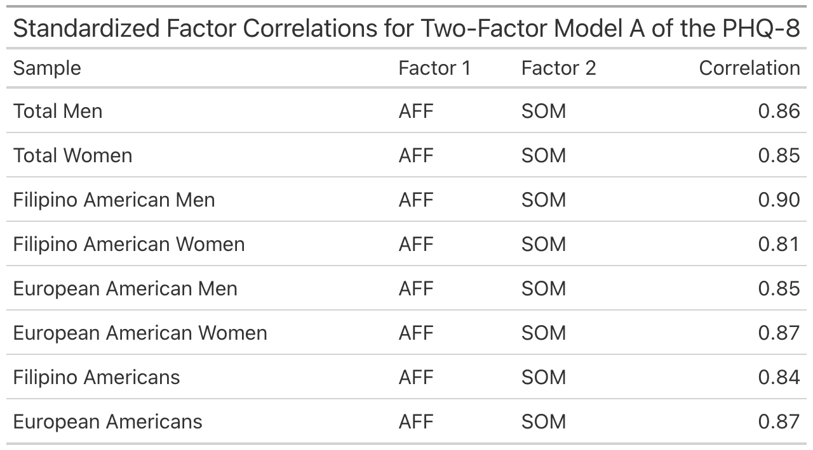

```

Standardized factor loadings are reported to summarize the strength of association between each PHQ-8 item and its respective latent factor under the Two-factor Model A specification. Patterns of loadings across analytic subgroups are examined to assess the stability of item–factor relationships for the cognitive-affective and somatic symptom domains.

```{r}
#| label: cfa-twofactor-A-loadings-table
#| echo: true
#| message: false
#| warning: false

# -------------------------------------------------------------------
# Extract standardized factor loadings (AFF, SOM) for Model A
# -------------------------------------------------------------------

get_loadings_2A <- function(fit, group_label) {
  pe <- parameterEstimates(fit, standardized = TRUE)

  pe <- pe[
    pe$op == "=~" & pe$lhs %in% c("AFF", "SOM"),
    c("lhs", "rhs", "std.all")
  ]

  data.frame(
    Factor  = pe$lhs,
    Item    = toupper(pe$rhs),
    Group   = group_label,
    Loading = pe$std.all,
    stringsAsFactors = FALSE
  )
}

# -------------------------------------------------------------------
# Helper to compute omega for a single factor from a lavaan fit
# (based on standardized loadings and residual variances)
# -------------------------------------------------------------------

compute_omega_factor_2A <- function(fit, factor_name) {
  pe <- parameterEstimates(fit, standardized = TRUE)

  # Standardized loadings for this factor
  load_rows <- pe$op == "=~" & pe$lhs == factor_name
  lambdas   <- pe$std.all[load_rows]
  items     <- pe$rhs[load_rows]

  # Residual variances for those items (std.all, lhs == rhs)
  theta_rows <- pe$op == "~~" & pe$lhs %in% items & pe$lhs == pe$rhs
  thetas     <- pe$std.all[theta_rows]

  # McDonald's omega for an equal-weight composite of the items
  num <- (sum(lambdas))^2
  den <- num + sum(thetas)

  omega <- num / den
  return(omega)
}

# -------------------------------------------------------------------
# Collect loadings across all analytic subgroups (long format)
# -------------------------------------------------------------------

loadings_2A_long <- rbind(
  get_loadings_2A(fit_2A_total_men,   "Total Men"),
  get_loadings_2A(fit_2A_total_women, "Total Women"),
  get_loadings_2A(fit_2A_fm,          "Filipino American Men"),
  get_loadings_2A(fit_2A_fw,          "Filipino American Women"),
  get_loadings_2A(fit_2A_em,          "European American Men"),
  get_loadings_2A(fit_2A_ew,          "European American Women"),
  get_loadings_2A(fit_2A_fa,          "Filipino Americans"),
  get_loadings_2A(fit_2A_ea,          "European Americans")
)

# -------------------------------------------------------------------
# Compute omegas for AFF and SOM in each subgroup
# -------------------------------------------------------------------

get_omegas_2A <- function(fit, group_label) {
  data.frame(
    Factor = c("AFF", "SOM"),
    Group  = group_label,
    Omega  = c(
      compute_omega_factor_2A(fit, "AFF"),
      compute_omega_factor_2A(fit, "SOM")
    ),
    stringsAsFactors = FALSE
  )
}

omegas_2A_long <- rbind(
  get_omegas_2A(fit_2A_total_men,   "Total Men"),
  get_omegas_2A(fit_2A_total_women, "Total Women"),
  get_omegas_2A(fit_2A_fm,          "Filipino American Men"),
  get_omegas_2A(fit_2A_fw,          "Filipino American Women"),
  get_omegas_2A(fit_2A_em,          "European American Men"),
  get_omegas_2A(fit_2A_ew,          "European American Women"),
  get_omegas_2A(fit_2A_fa,          "Filipino Americans"),
  get_omegas_2A(fit_2A_ea,          "European Americans")
)

# -------------------------------------------------------------------
# Convert loadings to wide format and order by factor and item
# -------------------------------------------------------------------

loadings_2A_wide <- loadings_2A_long %>%
  dplyr::mutate(Loading = round(Loading, 2)) %>%
  tidyr::pivot_wider(
    id_cols    = c(Factor, Item),
    names_from = Group,
    values_from = Loading
  ) %>%
  dplyr::arrange(Factor, Item)

# -------------------------------------------------------------------
# Convert omegas to wide format and append as "Omega" row per factor
# -------------------------------------------------------------------

group_cols <- setdiff(names(loadings_2A_wide), c("Factor", "Item"))

omegas_2A_wide <- omegas_2A_long %>%
  dplyr::mutate(Omega = round(Omega, 2)) %>%
  tidyr::pivot_wider(
    id_cols    = Factor,
    names_from = Group,
    values_from = Omega
  ) %>%
  dplyr::mutate(Item = "Omega") %>%
  dplyr::select(Factor, Item, dplyr::all_of(group_cols))

# Bind loadings and omega rows, keep "Omega" at bottom within each factor
loadings_2A_with_omega <- dplyr::bind_rows(loadings_2A_wide, omegas_2A_wide) %>%
  dplyr::mutate(
    Item = factor(
      Item,
      levels = c(
        "PHQ1", "PHQ2", "PHQ3", "PHQ4", "PHQ5", "PHQ6", "PHQ7", "PHQ8", "Omega"
      )
    )
  ) %>%
  dplyr::arrange(Factor, Item)

# -------------------------------------------------------------------
# Build gt table object (for HTML + interactive view)
# -------------------------------------------------------------------

gt_cfa_2A_loadings <- loadings_2A_with_omega %>%
  gt::gt() %>%
  gt::tab_spanner(
    label   = "Standardized Loadings (rows PHQ1–PHQ8) and Omega (row Omega)",
    columns = -c(Factor, Item)
  ) %>%
  gt::tab_header(
    title = gt::md("Standardized Loadings and Omega for Two-Factor Model A of the PHQ-8 by Group")
  )


```

> **Interpretation and manuscript correspondence.**
>
> The standardized factor loadings and McDonald’s ω values reproduced here correspond to the estimates reported in Tables 5 and 6 of the manuscript. The tables in this supplement are presented in a code-forward format to support transparent replication of the underlying estimates. The manuscript tables present the same numerical results in a typeset publication format.

**Render the two-factor PHQ-8 CFA Model A standardized factor loadings and McDonald’s omega estimates for all analytic groups in HTML, and export a high-resolution PNG version for inclusion in the PDF.**

```{r}
#| label: cfa-twofactor-A-loadings-table-html
#| echo: true
#| message: false
#| warning: false
#| eval: !expr knitr::is_html_output()

# HTML: show loadings/omega table in the supplement
gt_cfa_2A_loadings

# Save for manuscript Tables 5 and 6
gt::gtsave(
  data     = gt_cfa_2A_loadings,
  filename = "table5_6_twofactorA_loadings_omega.png",
  path     = "tables",
  zoom     = 2
)

```

**Insert the saved two-factor PHQ-8 CFA Model A standardized loadings and McDonald’s omega table image into the PDF version of the supplement.**

```{r}
#| label: cfa-twofactor-A-loadings-table-pdf
#| echo: true
#| message: false
#| warning: false
#| eval: !expr knitr::is_latex_output()
#| fig-align: "center"
#| out-width: "100%"

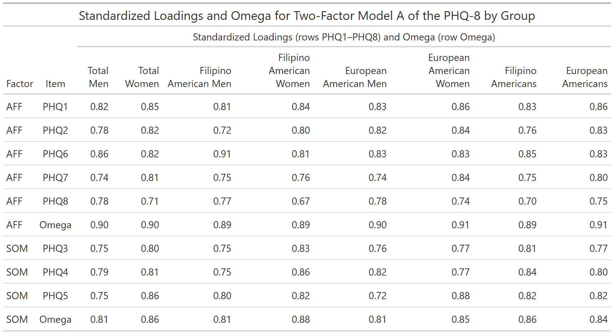

```

------------------------------------------------------------------------

### 5.3 Two-factor model B

The second two-factor specification represents an alternative cognitive-affective and somatic partition of PHQ-8 items proposed in prior psychometric work. This model allows direct comparison of competing two-factor structures under identical estimation and subgrouping conditions. Model fit indices and parameter estimates are presented to facilitate comparison with both the one-factor model and Two-factor Model A.

**In this specification, the cognitive-affective factor is indicated by items 1, 2, and 6, whereas the somatic factor is indicated by items 3–5, 7, and 8.**

```{r}
#| label: cfa-diagram-twofactor-B
#| echo: true
#| message: false
#| warning: false
#| fig-cap: "Diagram of the two-factor PHQ-8 Model B (alternative Cognitive-Affective vs. Somatic allocation)."

# -------------------------------------------------------------------
# Diagram code for Two-Factor Model B
# -------------------------------------------------------------------

diagram_code_twofactor_B <- "
digraph {

  label = 'Two Factor Model B of the PHQ-8'
  graph [ranksep = .3]

  # Observed indicators
  node [shape = box]
  phq1;
  phq2;
  phq6;

  node [shape = box]
  phq3;
  phq4;
  phq5;
  phq7;
  phq8;

  # Latent factors
  node [shape = circle]
  Affective [label = 'Cognitive–Affective'];
  Somatic;

  # Factor loadings
  edge [minlen = 3.5]

  Affective -> phq1
  Affective -> phq2
  Affective -> phq6

  Somatic -> phq3
  Somatic -> phq4
  Somatic -> phq5
  Somatic -> phq7
  Somatic -> phq8

  # Correlated factors
  Affective -> Somatic [dir = both]
}
"

# Build DiagrammeR graph object
twofactor_B_graph <- DiagrammeR::grViz(diagram_code_twofactor_B)

# -------------------------------------------------------------------
# Ensure static PNG exists for PDF output
# -------------------------------------------------------------------

svg_txt <- DiagrammeRsvg::export_svg(twofactor_B_graph)
rsvg::rsvg_png(
  charToRaw(svg_txt),
  file = "figures/cfa_twofactor_modelB.png"
)

# -------------------------------------------------------------------
# Format-specific rendering
# -------------------------------------------------------------------

if (knitr::is_html_output()) {

  # HTML / IDE preview: interactive DiagrammeR widget
  twofactor_B_graph

} else if (knitr::is_latex_output()) {

  # PDF: use static PNG
  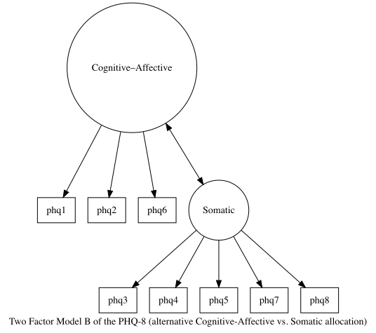

} else {

  # Fallback for other formats / interactive cases
  twofactor_B_graph
}

```

**Two-factor Model B CFA estimated separately across analytic subgroups.**

```{r}
#| label: cfa-twofactor-B-fit
#| echo: true
#| message: false
#| warning: false
#| eval: true

# -------------------------------------------------------------------
# Two-Factor PHQ-8 CFA — Model B (WLSMV, THETA)
#   AFF = Cognitive-Affective items (phq1, phq2, phq6)
#   SOM = Somatic items  (phq3, phq4, phq5, phq7, phq8)
# -------------------------------------------------------------------

phq_cfa_2B_model <- "
  AFF =~ phq1 + phq2 + phq6
  SOM =~ phq3 + phq4 + phq5 + phq7 + phq8
"

run_cfa_2B <- function(data) {
  cfa(
    model           = phq_cfa_2B_model,
    data            = data,
    ordered         = c('phq1','phq2','phq3','phq4',
                        'phq5','phq6','phq7','phq8'),
    estimator       = "WLSMV",
    parameterization = "theta"
  )
}

# Total analytic sample (Model B)
fit_2B_total <- run_cfa_2B(
  phq_subs %>%
    select(phq1:phq8)
)

# Subgroup models
fit_2B_total_men   <- run_cfa_2B(subset_total_men)
fit_2B_total_women <- run_cfa_2B(subset_total_women)

fit_2B_fm <- run_cfa_2B(subset_fm)
fit_2B_fw <- run_cfa_2B(subset_fw)

fit_2B_em <- run_cfa_2B(subset_em)
fit_2B_ew <- run_cfa_2B(subset_ew)

fit_2B_fa <- run_cfa_2B(subset_fa)
fit_2B_ea <- run_cfa_2B(subset_ea)

```

**Model fit indices for Two-factor Model B across subgroups.**

```{r}
#| label: cfa-twofactor-B-fit-table
#| echo: true
#| message: false
#| warning: false

# -------------------------------------------------------------------
# Collect Two-Factor Model B fit indices across analytic subgroups
# -------------------------------------------------------------------

CFA_2B_summary <- data.frame(
  Model = c(
    "Total Sample",
    "Total Men",
    "Total Women",
    "Filipino Americans",
    "Filipino American Men",
    "Filipino American Women",
    "European Americans",
    "European American Men",
    "European American Women"
  ),
  Par = c(
    fitMeasures(fit_2B_total,       "npar"),
    fitMeasures(fit_2B_total_men,   "npar"),
    fitMeasures(fit_2B_total_women, "npar"),
    fitMeasures(fit_2B_fa,          "npar"),
    fitMeasures(fit_2B_fm,          "npar"),
    fitMeasures(fit_2B_fw,          "npar"),
    fitMeasures(fit_2B_ea,          "npar"),
    fitMeasures(fit_2B_em,          "npar"),
    fitMeasures(fit_2B_ew,          "npar")
  ),
  ChiSq = c(
    fitMeasures(fit_2B_total,       "chisq"),
    fitMeasures(fit_2B_total_men,   "chisq"),
    fitMeasures(fit_2B_total_women, "chisq"),
    fitMeasures(fit_2B_fa,          "chisq"),
    fitMeasures(fit_2B_fm,          "chisq"),
    fitMeasures(fit_2B_fw,          "chisq"),
    fitMeasures(fit_2B_ea,          "chisq"),
    fitMeasures(fit_2B_em,          "chisq"),
    fitMeasures(fit_2B_ew,          "chisq")
  ),
  df = c(
    fitMeasures(fit_2B_total,       "df"),
    fitMeasures(fit_2B_total_men,   "df"),
    fitMeasures(fit_2B_total_women, "df"),
    fitMeasures(fit_2B_fa,          "df"),
    fitMeasures(fit_2B_fm,          "df"),
    fitMeasures(fit_2B_fw,          "df"),
    fitMeasures(fit_2B_ea,          "df"),
    fitMeasures(fit_2B_em,          "df"),
    fitMeasures(fit_2B_ew,          "df")
  ),
  p_value = c(
    fitMeasures(fit_2B_total,       "pvalue"),
    fitMeasures(fit_2B_total_men,   "pvalue"),
    fitMeasures(fit_2B_total_women, "pvalue"),
    fitMeasures(fit_2B_fa,          "pvalue"),
    fitMeasures(fit_2B_fm,          "pvalue"),
    fitMeasures(fit_2B_fw,          "pvalue"),
    fitMeasures(fit_2B_ea,          "pvalue"),
    fitMeasures(fit_2B_em,          "pvalue"),
    fitMeasures(fit_2B_ew,          "pvalue")
  ),
  CFI = c(
    fitMeasures(fit_2B_total,       "cfi"),
    fitMeasures(fit_2B_total_men,   "cfi"),
    fitMeasures(fit_2B_total_women, "cfi"),
    fitMeasures(fit_2B_fa,          "cfi"),
    fitMeasures(fit_2B_fm,          "cfi"),
    fitMeasures(fit_2B_fw,          "cfi"),
    fitMeasures(fit_2B_ea,          "cfi"),
    fitMeasures(fit_2B_em,          "cfi"),
    fitMeasures(fit_2B_ew,          "cfi")
  ),
  SRMR = c(
    fitMeasures(fit_2B_total,       "srmr"),
    fitMeasures(fit_2B_total_men,   "srmr"),
    fitMeasures(fit_2B_total_women, "srmr"),
    fitMeasures(fit_2B_fa,          "srmr"),
    fitMeasures(fit_2B_fm,          "srmr"),
    fitMeasures(fit_2B_fw,          "srmr"),
    fitMeasures(fit_2B_ea,          "srmr"),
    fitMeasures(fit_2B_em,          "srmr"),
    fitMeasures(fit_2B_ew,          "srmr")
  ),
  stringsAsFactors = FALSE
)

# -------------------------------------------------------------------
# Apply rounding and p-value formatting once (shared by HTML / PDF)
# -------------------------------------------------------------------

CFA_2B_summary_print <-
  CFA_2B_summary %>%
  dplyr::mutate(
    ChiSq   = round(ChiSq, 2),
    CFI     = round(CFI, 3),
    SRMR    = round(SRMR, 3),
    p_value = ifelse(
      p_value < 0.001,
      "<.001",
      sprintf("%.3f", p_value)
    )
  )

# -------------------------------------------------------------------
# Build gt table object (for HTML + interactive view)
# -------------------------------------------------------------------

gt_cfa_2B_summary <-
  CFA_2B_summary_print %>%
  gt::gt() %>%
  gt::cols_label(
    Model   = "Model",
    Par     = "Par",
    ChiSq   = "ChiSq",
    df      = gt::md("*df*"),
    p_value = gt::md("*p-value*"),
    CFI     = "CFI",
    SRMR    = "SRMR"
  ) %>%
  gt::tab_header(
    title = "Fit Statistics for the Two-Factor Model B"
  )

```

> **Note on correspondence to manuscript tables.**
>
> The fit indices reported in this table reproduce the numerical values used in the manuscript CFA results. The table formatting here is optimized for reproducibility and inspection of the analytic workflow, rather than for publication layout. The manuscript versions of these tables present the same values in a condensed, publication-formatted structure.

**Render the two-factor PHQ-8 CFA Model B fit indices for all analytic groups in HTML, and export a high-resolution PNG version for inclusion in the PDF.**

```{r}
#| label: cfa-twofactor-B-fit-table-html
#| echo: true
#| message: false
#| warning: false
#| eval: !expr knitr::is_html_output()

# Render the Model B fit table in HTML
gt_cfa_2B_summary

# Also save the PNG for manuscript Table 4 (Two-Factor Model B panel)
gt::gtsave(
  data     = gt_cfa_2B_summary,
  filename = "table4_twofactorB_cfa_fit.png",
  path     = "tables",
  zoom     = 2
)

```

**Insert the saved two-factor PHQ-8 CFA Model B fit table image into the PDF version of the supplement.**

```{r}
#| label: cfa-twofactor-B-fit-table-pdf
#| echo: true
#| message: false
#| warning: false
#| eval: !expr knitr::is_latex_output()
#| fig-align: "center"


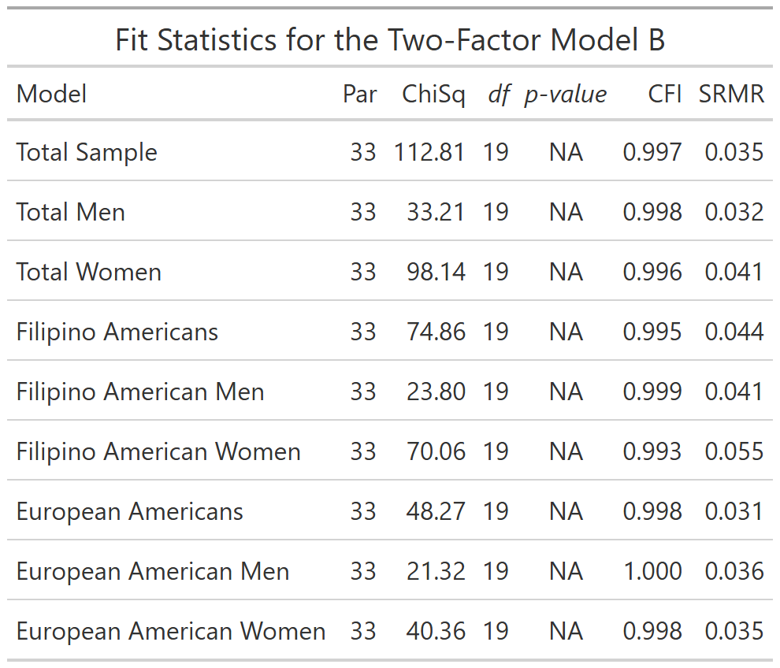

```

**Factor correlations for Two-factor Model B by subgroup.**

Standardized correlations between the cognitive-affective and somatic factors are reported to evaluate the degree of association between the two latent dimensions under the Two-factor Model B specification across analytic subgroups. Correlations are obtained from the lavaan standardized two-factor solution and reflect the latent factor associations estimated using ordinal indicators. The magnitude of these correlations informs the extent to which the cognitive-affective and somatic dimensions are empirically distinct.

```{r}
#| label: cfa-twofactor-B-factor-correlations
#| echo: true
#| message: false
#| warning: false

# -------------------------------------------------------------------
# Extract standardized latent factor correlations (AFF–SOM) for Model B
# -------------------------------------------------------------------

get_factor_corr_2B <- function(fit, sample_name) {
  cor_lv <- lavInspect(fit, "cor.lv")

  data.frame(
    Sample      = sample_name,
    Factor_1    = "AFF",
    Factor_2    = "SOM",
    Correlation = cor_lv["AFF", "SOM"],
    stringsAsFactors = FALSE
  )
}

CFA_2B_corr <- rbind(
  get_factor_corr_2B(fit_2B_total_men,   "Total Men"),
  get_factor_corr_2B(fit_2B_total_women, "Total Women"),
  get_factor_corr_2B(fit_2B_fm,          "Filipino American Men"),
  get_factor_corr_2B(fit_2B_fw,          "Filipino American Women"),
  get_factor_corr_2B(fit_2B_em,          "European American Men"),
  get_factor_corr_2B(fit_2B_ew,          "European American Women"),
  get_factor_corr_2B(fit_2B_fa,          "Filipino Americans"),
  get_factor_corr_2B(fit_2B_ea,          "European Americans")
)

# Round correlations once, shared across formats
CFA_2B_corr_print <- CFA_2B_corr %>%
  dplyr::mutate(Correlation = round(Correlation, 2))

# -------------------------------------------------------------------
# Build gt table object (for HTML + interactive view)
# -------------------------------------------------------------------

gt_cfa_2B_corr <- CFA_2B_corr_print %>%
  gt::gt() %>%
  gt::cols_label(
    Sample      = "Sample",
    Factor_1    = "Factor 1",
    Factor_2    = "Factor 2",
    Correlation = "Correlation"
  ) %>%
  gt::tab_header(
    title = "Standardized Factor Correlations for Two-Factor Model B of the PHQ-8"
  )

```

**Render the two-factor PHQ-8 CFA Model B latent factor correlations for all analytic groups in HTML, and export a high-resolution PNG version for inclusion in the PDF.**

```{r}
#| label: cfa-twofactor-B-factor-correlations-html
#| echo: true
#| message: false
#| warning: false
#| eval: !expr knitr::is_html_output()

# HTML: show factor correlation table inline
gt_cfa_2B_corr

# Save supplementary CFA PNG
gt::gtsave(
  data     = gt_cfa_2B_corr,
  filename = "cfa_twofactorB_factor_correlations.png",
  path     = "tables",
  zoom     = 2
)

```

**Insert the saved two-factor PHQ-8 CFA Model B latent factor correlation table image into the PDF version of the supplement.**

```{r}
#| label: cfa-twofactor-B-factor-correlations-pdf
#| echo: true
#| message: false
#| warning: false
#| eval: !expr knitr::is_latex_output()
#| fig-align: "center"


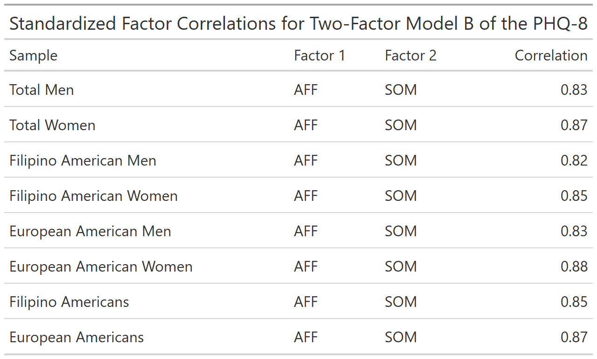

```

Standardized factor loadings are reported to summarize the strength of association between each PHQ-8 item and its assigned latent factor under the Two-factor Model B specification. Comparisons of loading patterns across analytic subgroups and across the competing two-factor models provide information about the stability and interpretability of alternative cognitive-affective and somatic partitions.

```{r}
#| label: cfa-twofactor-B-loadings-table
#| echo: true
#| message: false
#| warning: false

# -------------------------------------------------------------------
# Extract standardized factor loadings (AFF, SOM) for Model B
# -------------------------------------------------------------------

get_loadings_2B <- function(fit, group_label) {
  pe <- parameterEstimates(fit, standardized = TRUE)

  pe <- pe[
    pe$op == "=~" & pe$lhs %in% c("AFF", "SOM"),
    c("lhs", "rhs", "std.all")
  ]

  data.frame(
    Factor  = pe$lhs,
    Item    = toupper(pe$rhs),
    Group   = group_label,
    Loading = pe$std.all,
    stringsAsFactors = FALSE
  )
}

# -------------------------------------------------------------------
# Helper to compute omega for a single factor from a lavaan fit
# (based on standardized loadings and residual variances)
# -------------------------------------------------------------------

compute_omega_factor_2B <- function(fit, factor_name) {
  pe <- parameterEstimates(fit, standardized = TRUE)

  # Standardized loadings for this factor
  load_rows <- pe$op == "=~" & pe$lhs == factor_name
  lambdas   <- pe$std.all[load_rows]
  items     <- pe$rhs[load_rows]

  # Residual variances for those items (std.all, lhs == rhs)
  theta_rows <- pe$op == "~~" & pe$lhs %in% items & pe$lhs == pe$rhs
  thetas     <- pe$std.all[theta_rows]

  # McDonald's omega for an equal-weight composite
  num <- (sum(lambdas))^2
  den <- num + sum(thetas)

  omega <- num / den
  return(omega)
}

# -------------------------------------------------------------------
# Collect loadings across all analytic subgroups (long format)
# -------------------------------------------------------------------

loadings_2B_long <- rbind(
  get_loadings_2B(fit_2B_total_men,   "Total Men"),
  get_loadings_2B(fit_2B_total_women, "Total Women"),
  get_loadings_2B(fit_2B_fm,          "Filipino American Men"),
  get_loadings_2B(fit_2B_fw,          "Filipino American Women"),
  get_loadings_2B(fit_2B_em,          "European American Men"),
  get_loadings_2B(fit_2B_ew,          "European American Women"),
  get_loadings_2B(fit_2B_fa,          "Filipino Americans"),
  get_loadings_2B(fit_2B_ea,          "European Americans")
)

# -------------------------------------------------------------------
# Compute omegas for AFF and SOM in each subgroup
# -------------------------------------------------------------------

get_omegas_2B <- function(fit, group_label) {
  data.frame(
    Factor = c("AFF", "SOM"),
    Group  = group_label,
    Omega  = c(
      compute_omega_factor_2B(fit, "AFF"),
      compute_omega_factor_2B(fit, "SOM")
    ),
    stringsAsFactors = FALSE
  )
}

omegas_2B_long <- rbind(
  get_omegas_2B(fit_2B_total_men,   "Total Men"),
  get_omegas_2B(fit_2B_total_women, "Total Women"),
  get_omegas_2B(fit_2B_fm,          "Filipino American Men"),
  get_omegas_2B(fit_2B_fw,          "Filipino American Women"),
  get_omegas_2B(fit_2B_em,          "European American Men"),
  get_omegas_2B(fit_2B_ew,          "European American Women"),
  get_omegas_2B(fit_2B_fa,          "Filipino Americans"),
  get_omegas_2B(fit_2B_ea,          "European Americans")
)

# -------------------------------------------------------------------
# Convert loadings to wide format and order by factor and item
# -------------------------------------------------------------------

loadings_2B_wide <- loadings_2B_long %>%
  dplyr::mutate(Loading = round(Loading, 2)) %>%
  tidyr::pivot_wider(
    id_cols    = c(Factor, Item),
    names_from = Group,
    values_from = Loading
  ) %>%
  dplyr::arrange(Factor, Item)

# -------------------------------------------------------------------
# Convert omegas to wide format and append as "Omega" row per factor
# -------------------------------------------------------------------

group_cols <- setdiff(names(loadings_2B_wide), c("Factor", "Item"))

omegas_2B_wide <- omegas_2B_long %>%
  dplyr::mutate(Omega = round(Omega, 2)) %>%
  tidyr::pivot_wider(
    id_cols    = Factor,
    names_from = Group,
    values_from = Omega
  ) %>%
  # Add Item label and align column order with loadings table
  dplyr::mutate(Item = "Omega") %>%
  dplyr::select(Factor, Item, dplyr::all_of(group_cols))

# Bind loadings and omega rows, keep "Omega" at bottom within each factor
loadings_2B_with_omega <- dplyr::bind_rows(loadings_2B_wide, omegas_2B_wide) %>%
  dplyr::mutate(
    Item = factor(
      Item,
      levels = c(
        "PHQ1", "PHQ2", "PHQ3", "PHQ4", "PHQ5", "PHQ6", "PHQ7", "PHQ8", "Omega"
      )
    )
  ) %>%
  dplyr::arrange(Factor, Item)

# -------------------------------------------------------------------
# Format loadings + omega table for reporting (Tables 5 and 6)
# -------------------------------------------------------------------

gt_cfa_2B_loadings <- loadings_2B_with_omega %>%
  gt::gt() %>%
  gt::tab_spanner(
    label   = "Standardized Loadings (rows PHQ1–PHQ8) and Omega (row Omega)",
    columns = -c(Factor, Item)
  ) %>%
  gt::tab_header(
    title = gt::md("Standardized Loadings and Omega for Two-Factor Model B of the PHQ-8 by Group")
  )

```

> **Interpretation and manuscript correspondence.**
>
> The standardized factor loadings and McDonald’s ω values reproduced here correspond to the estimates reported in Tables 5 and 6 of the manuscript. The tables in this supplement are presented in a code-forward format to support transparent replication of the underlying estimates. The manuscript tables present the same numerical results in a typeset publication format.

**Render the two-factor PHQ-8 CFA Model B standardized factor loadings and McDonald’s omega estimates for all analytic groups in HTML, and export a high-resolution PNG version for inclusion in the PDF.**

```{r}
#| label: cfa-twofactor-B-loadings-table-html
#| echo: true
#| message: false
#| warning: false
#| eval: !expr knitr::is_html_output()

# HTML: show loadings/omega table inline
gt_cfa_2B_loadings

# Save for manuscript Tables 5 and 6 (PNG in tables/ directory)
gt::gtsave(
  data     = gt_cfa_2B_loadings,
  filename = "table5_6_twofactorB_loadings_omega.png",
  path     = "tables",
  zoom     = 2
)

```

**Insert the saved two-factor PHQ-8 CFA Model B standardized loadings and McDonald’s omega table image into the PDF version of the supplement.**

```{r}
#| label: cfa-twofactor-B-loadings-table-pdf
#| echo: true
#| message: false
#| warning: false
#| eval: !expr knitr::is_latex_output()
#| fig-align: "center"
#| out-width: "100%"

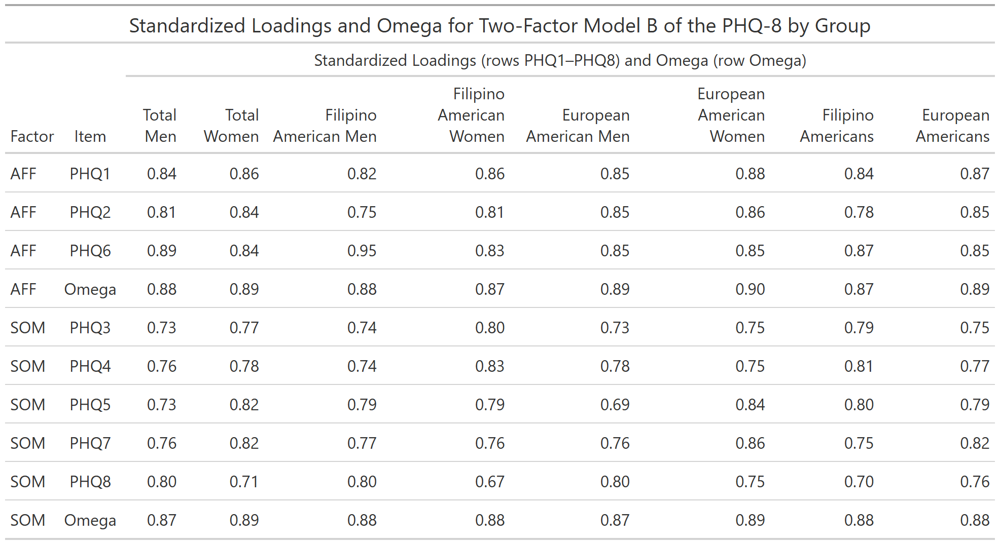

```

------------------------------------------------------------------------

## 6. Measurement invariance analyses

> **Correspondence to manuscript:** 
>
> Fit indices and ΔCFI/ΔSRMR results in this section reproduce the multigroup measurement invariance analyses reported in Table 7 of the manuscript.

Measurement invariance was evaluated using multi-group confirmatory factor analysis to assess whether PHQ-8 measurement properties were comparable across sex within selected ethnic groups. Invariance testing proceeded sequentially from configural to metric and scalar models, allowing increasingly restrictive equality constraints to be evaluated under identical estimation conditions.

All invariance models were estimated in lavaan using an estimator appropriate for ordinal indicators (DWLS / WLSMV-style). Model fit indices and changes in fit were examined to evaluate the extent to which equality constraints were supported. These analyses were conducted to assess the comparability of latent factor interpretation across groups rather than to test substantive mean differences.

Invariance decisions were evaluated using ΔCFI and ΔSRMR thresholds recommended for categorical indicators under WLSMV estimation (Chen, 2007).

Configural, metric, and scalar invariance models estimated across sex.

Invariance models are estimated sequentially, beginning with a configural model and proceeding to metric and scalar constraints. This sequence allows evaluation of whether factor loadings and item thresholds can be considered equivalent across sex within each population.

::: callout-note
#### Syntax scaffolding: PHQ-8 measurement invariance in lavaan

**Goal.** These chunks estimate multigroup one-factor CFA models to evaluate configural, metric, and scalar measurement invariance across ethnicity, across sex in the total sample, and across sex within the Filipino American and European American subsamples.

**Data and grouping.**

- The PHQ-8 items, phq1–phq8, are treated as ordered indicators.

- Grouping factors are created for ethnicity and sex.

- Separate Filipino American and European American datasets are used for the within-ethnicity sex comparisons.

**Model estimation.**

All models are estimated with lavaan::cfa() using:

- estimator = "WLSMV"

- parameterization = "theta"

- the same one-factor PHQ-8 model across comparisons.

**Invariance sequence.**

- **Configural invariance:** The same factor structure is estimated across groups without equality constraints.

- **Metric invariance:** Factor loadings are constrained equal using group.equal = c("loadings").

- **Scalar invariance:** Factor loadings and item thresholds are constrained equal using group.equal = c("loadings", "thresholds").

**Fit evaluation and reporting.**

lavaan::fitMeasures() is used to extract chi-square, degrees of freedom, CFI, and SRMR for each model. Changes in CFI and SRMR are computed relative to the preceding invariance model and assembled into the final measurement-invariance table.

**Software dependencies.**

- lavaan: multigroup CFA estimation and fit-index extraction.

- Base R and dplyr: subgroup preparation, model organization, and change-score computation.

- gt: construction and formatting of the final invariance table.
:::

### 6.1 Invariance testing by ethnicity

**Ethnicity prep: ordered items, group factor**

```{r}
#| label: ethnicity-lavaan-prep
#| echo: true
#| message: false
#| warning: false

# 1. Define PHQ-8 item names
phq_items <- paste0("phq", 1:8)

# 2. Ensure PHQ-8 items are treated as ordered factors for WLSMV
phq_total[phq_items] <- lapply(phq_total[phq_items], ordered)

# 3. Create ethnicity grouping factor for lavaan (European vs Filipino)
phq_total$eth_group <- factor(
  phq_total$filipino,
  levels = c(0, 1),
  labels = c("European", "Filipino")
)

# 4. One-factor PHQ-8 model
phq_model <- "
  dep =~ phq1 + phq2 + phq3 + phq4 +
         phq5 + phq6 + phq7 + phq8
"

```

**Ethnicity Configural Invariance**

```{r}
#| label: ethnicity-configural-lavaan
#| echo: true
#| message: false
#| warning: false
#| results: "hide"

# -------------------------------------------------------------------
# Configural invariance model (European vs Filipino)
#   — freely estimated loadings & thresholds across groups
# -------------------------------------------------------------------

fit_eth_config <- cfa(
  model            = phq_model,
  data             = phq_total,
  group            = "eth_group",
  ordered          = phq_items,
  estimator        = "WLSMV",
  parameterization = "theta"
)

# Extract selected fit indices (includes SRMR)
fitMeasures(
  fit_eth_config,
  c(
    "chisq", "df", "pvalue",
    "cfi", "tli",
    "rmsea", "rmsea.ci.lower", "rmsea.ci.upper",
    "srmr"
  )
)

```

**Ethnicity Metric Invariance**

```{r}
#| label: ethnicity-metric-lavaan
#| echo: true
#| message: false
#| warning: false
#| results: "hide"

# -------------------------------------------------------------------
# Metric invariance model (European vs Filipino)
#   — factor loadings constrained equal across groups
# -------------------------------------------------------------------

fit_eth_metric <- cfa(
  model            = phq_model,
  data             = phq_total,
  group            = "eth_group",
  ordered          = phq_items,
  estimator        = "WLSMV",
  parameterization = "theta",
  group.equal      = c("loadings")
)

# Extract selected fit indices (includes SRMR)
fitMeasures(
  fit_eth_metric,
  c(
    "chisq", "df", "pvalue",
    "cfi", "tli",
    "rmsea", "rmsea.ci.lower", "rmsea.ci.upper",
    "srmr"
  )
)

```

**Ethnicity Scalar Invariance**

```{r}
#| label: ethnicity-scalar-lavaan
#| echo: true
#| message: false
#| warning: false
#| results: "hide"

# -------------------------------------------------------------------
# Scalar invariance model (European vs Filipino)
#   — factor loadings and thresholds constrained equal across groups
# -------------------------------------------------------------------

fit_eth_scalar <- cfa(
  model            = phq_model,
  data             = phq_total,
  group            = "eth_group",
  ordered          = phq_items,
  estimator        = "WLSMV",
  parameterization = "theta",
  group.equal      = c("loadings", "thresholds")
)

# Extract selected fit indices (includes SRMR)
fitMeasures(
  fit_eth_scalar,
  c(
    "chisq", "df", "pvalue",
    "cfi", "tli",
    "rmsea", "rmsea.ci.lower", "rmsea.ci.upper",
    "srmr"
  )
)

```

### 6.2 Invariance testing by sex

**Sex prep: group factor**

This section defines the sex grouping variable used for multi-group invariance testing and applies the same PHQ-8 item set and model specification used in the subgroup CFAs. The resulting grouped dataset is used to estimate the configural, metric, and scalar invariance models across men and women within each population subgroup.

```{r}
#| label: sex-lavaan-prep
#| echo: true
#| message: false
#| warning: false

# Create sex grouping factor for lavaan (Men vs Women)
phq_total$sex_group <- factor(
  phq_total$female,
  levels = c(0, 1),
  labels = c("Men", "Women")
)

```

**Sex Configural Invariance**

```{r}
#| label: sex-configural-lavaan
#| echo: true
#| message: false
#| warning: false
#| results: "hide"

# -------------------------------------------------------------------
# Configural invariance model (Male vs Female)
#   — freely estimated loadings & thresholds across sex groups
# -------------------------------------------------------------------

fit_sex_config <- cfa(
  model            = phq_model,
  data             = phq_total,
  group            = "sex_group",
  ordered          = phq_items,
  estimator        = "WLSMV",
  parameterization = "theta"
)

# Extract selected fit indices (includes SRMR)
fitMeasures(
  fit_sex_config,
  c(
    "chisq", "df", "pvalue",
    "cfi", "tli",
    "rmsea", "rmsea.ci.lower", "rmsea.ci.upper",
    "srmr"
  )
)

```

**Sex Metric Invariance**

```{r}
#| label: sex-metric-lavaan
#| echo: true
#| message: false
#| warning: false
#| results: "hide"

# -------------------------------------------------------------------
# Metric invariance model (Male vs Female)
#   — factor loadings constrained equal across sex groups
# -------------------------------------------------------------------

fit_sex_metric <- cfa(
  model            = phq_model,
  data             = phq_total,
  group            = "sex_group",
  ordered          = phq_items,
  estimator        = "WLSMV",
  parameterization = "theta",
  group.equal      = c("loadings")
)

# Extract selected fit indices (includes SRMR)
fitMeasures(
  fit_sex_metric,
  c(
    "chisq", "df", "pvalue",
    "cfi", "tli",
    "rmsea", "rmsea.ci.lower", "rmsea.ci.upper",
    "srmr"
  )
)

```

**Sex Scalar Invariance**

```{r}
#| label: sex-scalar-lavaan
#| echo: true
#| message: false
#| warning: false
#| results: "hide"

# -------------------------------------------------------------------
# Scalar invariance model (Male vs Female)
#   — factor loadings and thresholds constrained equal across groups
# -------------------------------------------------------------------

fit_sex_scalar <- cfa(
  model            = phq_model,
  data             = phq_total,
  group            = "sex_group",
  ordered          = phq_items,
  estimator        = "WLSMV",
  parameterization = "theta",
  group.equal      = c("loadings", "thresholds")
)

# Extract selected fit indices (includes SRMR)
fitMeasures(
  fit_sex_scalar,
  c(
    "chisq", "df", "pvalue",
    "cfi", "tli",
    "rmsea", "rmsea.ci.lower", "rmsea.ci.upper",
    "srmr"
  )
)

```

### 6.3 Invariance testing among Filipino American women and men

**Prep: subset to Filipino only + sex grouping**

```{r}
#| label: filipino-sex-lavaan-prep
#| echo: true
#| message: false
#| warning: false

# 1. Subset to Filipino Americans only (filipino == 1)
phq_fil <- subset(phq_total, filipino == 1)

# 2. Ensure PHQ-8 items are ordered factors within the subset
phq_fil[phq_items] <- lapply(phq_fil[phq_items], ordered)

# 3. Create sex grouping factor within Filipinos
#    (0 = Male, 1 = Female)
phq_fil$sex_group <- factor(
  phq_fil$female,
  levels = c(0, 1),
  labels = c("Male", "Female")
)

```

**Filipino Sex Configural Invariance**

```{r}
#| label: filipino-sex-configural-lavaan
#| echo: true
#| message: false
#| warning: false
#| results: "hide"

# -------------------------------------------------------------------
# Configural invariance (Filipino subsample: Male vs Female)
#   — freely estimated loadings & thresholds across sex groups
# -------------------------------------------------------------------

fit_fil_sex_config <- cfa(
  model            = phq_model,
  data             = phq_fil,
  group            = "sex_group",
  ordered          = phq_items,
  estimator        = "WLSMV",
  parameterization = "theta"
)

# Extract selected fit indices (includes SRMR)
fitMeasures(
  fit_fil_sex_config,
  c(
    "chisq", "df", "pvalue",
    "cfi", "tli",
    "rmsea", "rmsea.ci.lower", "rmsea.ci.upper",
    "srmr"
  )
)
```

**Filipino Sex Metric Invariance**

```{r}
#| label: filipino-sex-metric-lavaan
#| echo: true
#| message: false
#| warning: false
#| results: "hide"

# -------------------------------------------------------------------
# Metric invariance (Filipino subsample: Male vs Female)
#   — factor loadings constrained equal across sex groups
# -------------------------------------------------------------------

fit_fil_sex_metric <- cfa(
  model            = phq_model,
  data             = phq_fil,
  group            = "sex_group",
  ordered          = phq_items,
  estimator        = "WLSMV",
  parameterization = "theta",
  group.equal      = c("loadings")
)

# Extract selected fit indices (includes SRMR)
fitMeasures(
  fit_fil_sex_metric,
  c(
    "chisq", "df", "pvalue",
    "cfi", "tli",
    "rmsea", "rmsea.ci.lower", "rmsea.ci.upper",
    "srmr"
  )
)

```

**Filipino Sex Scalar Invariance**

```{r}
#| label: filipino-sex-scalar-lavaan
#| echo: true
#| message: false
#| warning: false
#| results: "hide"

# -------------------------------------------------------------------
# Scalar invariance (Filipino subsample: Male vs Female)
#   — factor loadings and thresholds constrained equal across sex
# -------------------------------------------------------------------

fit_fil_sex_scalar <- cfa(
  model            = phq_model,
  data             = phq_fil,
  group            = "sex_group",
  ordered          = phq_items,
  estimator        = "WLSMV",
  parameterization = "theta",
  group.equal      = c("loadings", "thresholds")
)

# Extract selected fit indices (includes SRMR)
fitMeasures(
  fit_fil_sex_scalar,
  c(
    "chisq", "df", "pvalue",
    "cfi", "tli",
    "rmsea", "rmsea.ci.lower", "rmsea.ci.upper",
    "srmr"
  )
)
```

### 6.4 Invariance testing among European American women and men

**Prep: subset to American / European only + sex grouping**

```{r}
#| label: european-sex-lavaan-prep
#| echo: true
#| message: false
#| warning: false

# 1. Subset to European Americans only (filipino == 0)
phq_eur <- subset(phq_total, filipino == 0)

# 2. Ensure PHQ-8 items are ordered factors within the subset
phq_eur[phq_items] <- lapply(phq_eur[phq_items], ordered)

# 3. Create sex grouping factor within Europeans
#    (0 = Male, 1 = Female)
phq_eur$sex_group <- factor(
  phq_eur$female,
  levels = c(0, 1),
  labels = c("Male", "Female")
)

```

**European American Women and Men Configural**

```{r}
#| label: european-sex-configural-lavaan
#| echo: true
#| message: false
#| warning: false
#| results: "hide"

# -------------------------------------------------------------------
# Configural invariance (European subsample: Male vs Female)
#   — freely estimated loadings & thresholds across sex groups
# -------------------------------------------------------------------

fit_eur_sex_config <- cfa(
  model            = phq_model,
  data             = phq_eur,
  group            = "sex_group",
  ordered          = phq_items,
  estimator        = "WLSMV",
  parameterization = "theta"
)

# Extract selected fit indices (includes SRMR)
fitMeasures(
  fit_eur_sex_config,
  c(
    "chisq", "df", "pvalue",
    "cfi", "tli",
    "rmsea", "rmsea.ci.lower", "rmsea.ci.upper",
    "srmr"
  )
)

```

**European American Women and Men Metric**

```{r}
#| label: european-sex-metric-lavaan
#| echo: true
#| message: false
#| warning: false
#| results: "hide"

# -------------------------------------------------------------------
# Metric invariance (European subsample: Male vs Female)
#   — factor loadings constrained equal across sex groups
# -------------------------------------------------------------------

fit_eur_sex_metric <- cfa(
  model            = phq_model,
  data             = phq_eur,
  group            = "sex_group",
  ordered          = phq_items,
  estimator        = "WLSMV",
  parameterization = "theta",
  group.equal      = c("loadings")
)

# Extract selected fit indices (includes SRMR)
fitMeasures(
  fit_eur_sex_metric,
  c(
    "chisq", "df", "pvalue",
    "cfi", "tli",
    "rmsea", "rmsea.ci.lower", "rmsea.ci.upper",
    "srmr"
  )
)
```

**European American Women and Men Scalar**

```{r}
#| label: european-sex-scalar-lavaan
#| echo: true
#| message: false
#| warning: false
#| results: "hide"

# -------------------------------------------------------------------
# Scalar invariance (European subsample: Male vs Female)
#   — factor loadings and thresholds constrained equal across sex
# -------------------------------------------------------------------

fit_eur_sex_scalar <- cfa(
  model            = phq_model,
  data             = phq_eur,
  group            = "sex_group",
  ordered          = phq_items,
  estimator        = "WLSMV",
  parameterization = "theta",
  group.equal      = c("loadings", "thresholds")
)

# Extract selected fit indices (includes SRMR)
fitMeasures(
  fit_eur_sex_scalar,
  c(
    "chisq", "df", "pvalue",
    "cfi", "tli",
    "rmsea", "rmsea.ci.lower", "rmsea.ci.upper",
    "srmr"
  )
)
```

------------------------------------------------------------------------

**Construction of Fit Index Extraction Utility Function**

```{r}
#| label: invariance-helper
#| echo: true
#| message: false
#| warning: false

# Construct a single summary row for a given model:
#   - Group, Model label
#   - Chi-square, df, CFI, SRMR

get_fit_row <- function(fit, group_label, model_label, ref_fit = NULL) {
  fm <- fitMeasures(fit, c("chisq", "df", "cfi", "srmr"))

  row <- data.frame(
    Group = group_label,
    Model = model_label,
    ChiSq = as.numeric(fm["chisq"]),
    df    = as.numeric(fm["df"]),
    CFI   = as.numeric(fm["cfi"]),
    SRMR  = as.numeric(fm["srmr"]),
    stringsAsFactors = FALSE
  )

  if (!is.null(ref_fit)) {
    ref_fm <- fitMeasures(ref_fit, c("cfi", "srmr"))
    row$Delta_CFI  <- row$CFI  - as.numeric(ref_fm["cfi"])
    row$Delta_SRMR <- row$SRMR - as.numeric(ref_fm["srmr"])
  } else {
    row$Delta_CFI  <- NA_real_
    row$Delta_SRMR <- NA_real_
  }

  row
}

```

**Compilation of Model Fit Statistics Across Invariance Models and Subgroups**

```{r}
#| label: invariance-table-data
#| echo: true
#| message: false
#| warning: false

# -------------------------------------------------------------------
# Build stacked table of configural / metric / scalar models
# across all invariance analyses, with optional ΔCFI / ΔSRMR
# -------------------------------------------------------------------

invar_table <- bind_rows(

  # Ethnicity — full sample
  get_fit_row(fit_eth_config,  "Ethnicity (Filipino vs European)", "Configural"),
  get_fit_row(fit_eth_metric,  "Ethnicity (Filipino vs European)", "Metric",
              ref_fit = fit_eth_config),
  get_fit_row(fit_eth_scalar,  "Ethnicity (Filipino vs European)", "Scalar",
              ref_fit = fit_eth_metric),

  # sex — full sample
  get_fit_row(fit_sex_config, "sex (All participants)", "Configural"),
  get_fit_row(fit_sex_metric, "sex (All participants)", "Metric",
              ref_fit = fit_sex_config),
  get_fit_row(fit_sex_scalar, "sex (All participants)", "Scalar",
              ref_fit = fit_sex_metric),

  # sex — Filipino subsample
  get_fit_row(fit_fil_sex_config, "sex (Filipino Americans)", "Configural"),
  get_fit_row(fit_fil_sex_metric, "sex (Filipino Americans)", "Metric",
              ref_fit = fit_fil_sex_config),
  get_fit_row(fit_fil_sex_scalar, "sex (Filipino Americans)", "Scalar",
              ref_fit = fit_fil_sex_metric),

  # sex — European subsample
  get_fit_row(fit_eur_sex_config, "sex (European Americans)", "Configural"),
  get_fit_row(fit_eur_sex_metric, "sex (European Americans)", "Metric",
              ref_fit = fit_eur_sex_config),
  get_fit_row(fit_eur_sex_scalar, "sex (European Americans)", "Scalar",
              ref_fit = fit_eur_sex_metric)
)

# -------------------------------------------------------------------
# Round and format numeric columns for presentation
# -------------------------------------------------------------------

invar_table <- invar_table %>%
  mutate(
    ChiSq      = round(ChiSq, 2),
    CFI        = round(CFI, 3),
    SRMR       = round(SRMR, 3),
    Delta_CFI  = round(Delta_CFI, 3),
    Delta_SRMR = round(Delta_SRMR, 3)
  ) %>%
  mutate(
    Delta_CFI  = ifelse(is.na(Delta_CFI),  "—", sprintf("%.3f", Delta_CFI)),
    Delta_SRMR = ifelse(is.na(Delta_SRMR), "—", sprintf("%.3f", Delta_SRMR))
  )

```

**Formatted Presentation of Measurement Invariance Model Fit Results**

```{r}
#| label: invariance-table-gt
#| echo: true
#| message: false
#| warning: false

# -------------------------------------------------------------------
# Format invariance fit table (Ethnicity + sex invariance models)
# -------------------------------------------------------------------

gt_invariance <- invar_table %>%
  gt::gt() %>%
  gt::cols_label(
    Group      = "Grouping variable",
    Model      = "Model",
    ChiSq      = "ChiSq",
    df         = gt::md("*df*"),
    CFI        = "CFI",
    SRMR       = "SRMR",
    Delta_CFI  = "ΔCFI",
    Delta_SRMR = "ΔSRMR"
  ) %>%
  gt::cols_align(
    align   = "left",
    columns = c(Group, Model)
  ) %>%
  gt::cols_align(
    align   = "center",
    columns = c(ChiSq, df, CFI, SRMR, Delta_CFI, Delta_SRMR)
  ) %>%
  gt::tab_header(
    title = "Model Fit Statistics for One-Factor Measurement Invariance Models"
  )

```

**Render the multigroup PHQ-8 measurement invariance model fit indices (configural, metric, and scalar) for all group comparisons in HTML, and export a high-resolution PNG version for inclusion in the PDF.**

```{r}
#| label: invariance-table-gt-html
#| echo: true
#| message: false
#| warning: false
#| eval: !expr knitr::is_html_output()

# Render invariance fit table in HTML
gt_invariance

# Save PNG for manuscript Table 7
gt::gtsave(
  data     = gt_invariance,
  filename = "table7_invariance_fit.png",
  path     = "tables",
  zoom     = 2
)

```

**Insert the saved multigroup PHQ-8 measurement invariance fit table image into the PDF version of the supplement.**

```{r}
#| label: invariance-table-gt-pdf
#| echo: true
#| message: false
#| warning: false
#| eval: !expr knitr::is_latex_output()
#| fig-align: "center"
#| out-width: "100%"

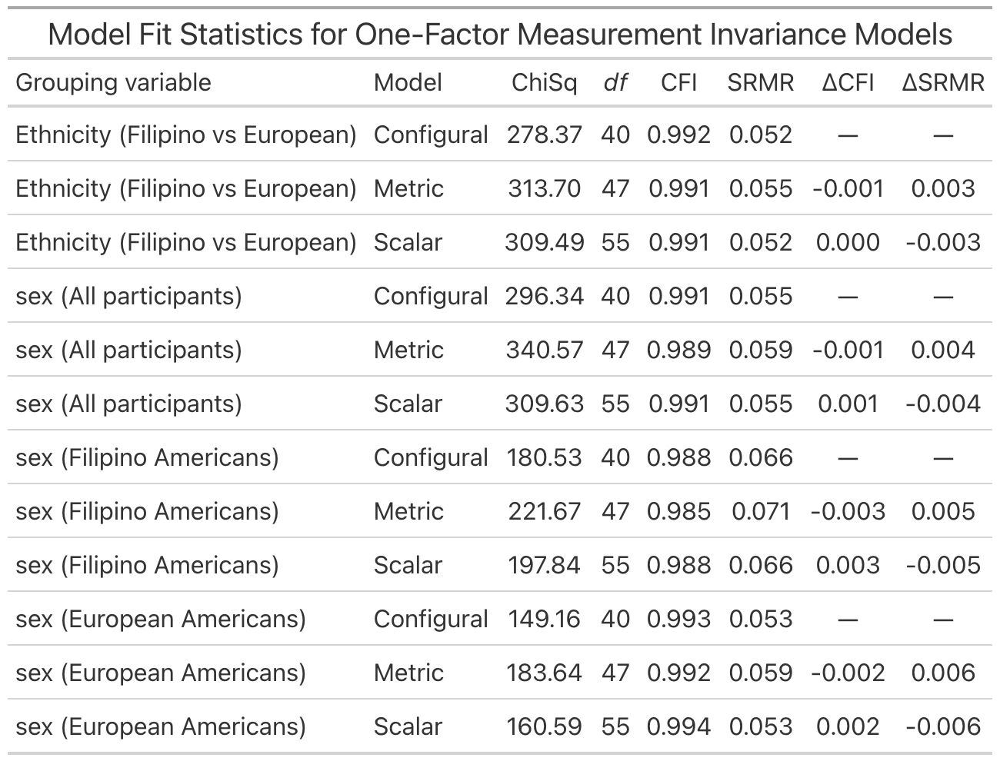

```

------------------------------------------------------------------------

## 7. Theoretically Related Variables

> **Correspondence to manuscript:** 
>
> Correlation estimates in this section reproduce the associations between PHQ-8 scores and theoretically related constructs reported in Table 8 of the manuscript.

Correlations were computed between PHQ-8 mean scores and a set of theoretically related constructs (depressive symptoms, anxiety, perceived stress, brooding rumination, self-deprecation, positive self-esteem, and quality of life). Correlations were estimated for the total sample, by sex, and separately within Filipino American and European American subgroups using pairwise-complete observations. These analyses were conducted to evaluate convergent and discriminant validity of the PHQ-8 across groups.

::: callout-note
#### Syntax scaffolding: Correlational validity with related constructs

- **Goal.** This chunk reproduces the correlations between PHQ-8 scores and theoretically related constructs for the total sample and the sex- and ethnicity-based subgroups reported in Table 8.

  **Scales and variables.**

  - `phq_mean` is the mean PHQ-8 score created earlier in the workflow.

  - The theoretically related variables are `cesd_mean`, `gad_mean`, `stress_mean`, `brood_mean`, `selfdep_mean`, `posesteem_mean`, and `qol`, representing depressive symptoms, anxiety, perceived stress, brooding rumination, self-deprecation, positive esteem, and quality of life, respectively.

  **Correlation and confidence-interval estimation.**

  The helper function `compute_r_ci()` calculates the Pearson correlation between `phq_mean` and each related variable. For each correlation, the function:

  - retains complete observations for the specific pair of variables,

  - calculates the Pearson correlation,

  - generates 5,000 nonparametric bootstrap samples,

  - derives a 95% percentile bootstrap confidence interval, and

  - formats the estimate and confidence limits without leading zeros.

  Cases with insufficient observations or no variation in either variable are returned as missing.

  **Subgroup organization.**

  The helper function `make_corr_column()` applies `compute_r_ci()` to every theoretically related variable. Correlations are calculated for:

  - the total sample,

  - men and women in the total sample,

  - Filipino Americans overall, Filipino American men, and Filipino American women, and

  - European Americans overall, European American men, and European American women.

  `set.seed(2026)` is used before estimation so that the bootstrap confidence intervals are reproducible across renders.

  **Tabling.**

  The formatted correlation strings are assembled into a single data frame and passed to `gt::gt()`. The resulting table contains one row for each theoretically related construct and separate columns for the total sample and each subgroup. `gt` functions are used to apply readable column labels, grouped subgroup headings, alignment, and the table note.

  **Software dependencies.**

  - Base R: correlation estimation, resampling, subsetting, indexing, and formatting.

  - `gt`: construction and formatting of the final Table 8 output.
:::

```{r}
#| label: phq-related-correlations-table
#| echo: true
#| message: false
#| warning: false

# -------------------------------------------------------------------
# PHQ-8 vs. theoretically related constructs (Table 8)
# Correlations with bootstrap 95% CIs
# -------------------------------------------------------------------

related_vars <- c(
  "cesd_mean",
  "gad_mean",
  "stress_mean",
  "brood_mean",
  "selfdep_mean",
  "posesteem_mean",
  "qol"
)

related_labels <- c(
  "CES-D-10",
  "Anxiety",
  "Perceived stress",
  "Brooding rumination",
  "Self-deprecation",
  "Positive esteem",
  "Quality of life"
)

# APA-style number formatting: .44 instead of 0.44
apa_r <- function(x, digits = 2) {
  out <- sprintf(paste0("%.", digits, "f"), x)
  out <- sub("^0\\.", ".", out)
  out <- sub("^-0\\.", "-.", out)
  out
}

# Helper: bootstrap correlation CI for phq_mean with a given variable
compute_r_ci <- function(data, y_var, x_var = "phq_mean", R = 5000, conf = .95) {
  
  # Keep only the two variables needed for this correlation
  d <- data[, c(x_var, y_var)]
  
  # Use complete cases for this specific pair of variables
  d <- d[complete.cases(d), ]
  
  # Store pairwise n
  n <- nrow(d)
  
  # Return missing if there are too few cases or no variation
  if (
    n < 4 ||
    sd(d[[x_var]], na.rm = TRUE) == 0 ||
    sd(d[[y_var]], na.rm = TRUE) == 0
  ) {
    return(NA_character_)
  }
  
  # Observed Pearson correlation
  r_obs <- cor(d[[x_var]], d[[y_var]])
  
  # Bootstrap correlations
  boot_rs <- replicate(R, {
    idx <- sample.int(n, size = n, replace = TRUE)
    
    x_boot <- d[[x_var]][idx]
    y_boot <- d[[y_var]][idx]
    
    # Some bootstrap samples may have zero variance; suppress warning and return NA
    suppressWarnings(cor(x_boot, y_boot))
  })
  
  # Remove failed bootstrap samples
  boot_rs <- boot_rs[!is.na(boot_rs)]
  
  # Percentile bootstrap CI
  alpha <- 1 - conf
  ci <- quantile(
    boot_rs,
    probs = c(alpha / 2, 1 - alpha / 2),
    na.rm = TRUE,
    names = FALSE
  )
  
  # Format as r [LL, UL]
  paste0(
    apa_r(r_obs),
    " [",
    apa_r(ci[1]),
    ", ",
    apa_r(ci[2]),
    "]"
  )
}

# Helper: apply the correlation + CI function to all related variables
make_corr_column <- function(data) {
  sapply(
    related_vars,
    function(v) compute_r_ci(data, v, R = 5000),
    USE.NAMES = FALSE
  )
}

# Set seed once so the bootstrap CIs are reproducible
set.seed(2026)

# Construct correlation table across total / sex / ethnicity cells
corr_df <- data.frame(
  Related_Variable = related_labels,
  Total_Both  = make_corr_column(phq_total),
  Total_Men   = make_corr_column(subset(phq_total, female == 0)),
  Total_Women = make_corr_column(subset(phq_total, female == 1)),
  Fil_Total   = make_corr_column(subset(phq_total, filipino == 1)),
  Fil_Men     = make_corr_column(subset(phq_total, filipino == 1 & female == 0)),
  Fil_Women   = make_corr_column(subset(phq_total, filipino == 1 & female == 1)),
  Eur_Total   = make_corr_column(subset(phq_total, filipino == 0)),
  Eur_Men     = make_corr_column(subset(phq_total, filipino == 0 & female == 0)),
  Eur_Women   = make_corr_column(subset(phq_total, filipino == 0 & female == 1)),
  check.names = FALSE
)

# -------------------------------------------------------------------
# Format correlation table with gt
# -------------------------------------------------------------------

gt_phq_corr <- corr_df %>%
  gt::gt() %>%
  gt::cols_label(
    Related_Variable = "Related Variable",
    Total_Both       = "Total Sample\nBoth",
    Total_Men        = "Total Sample\nMen",
    Total_Women      = "Total Sample\nWomen",
    Fil_Total        = "Filipino Americans\nTotal",
    Fil_Men          = "Filipino Americans\nMen",
    Fil_Women        = "Filipino Americans\nWomen",
    Eur_Total        = "European Americans\nTotal",
    Eur_Men          = "European Americans\nMen",
    Eur_Women        = "European Americans\nWomen"
  ) %>%
  gt::cols_align(
    align   = "left",
    columns = Related_Variable
  ) %>%
  gt::cols_align(
    align   = "center",
    columns = -Related_Variable
  ) %>%
  gt::tab_header(
    title = "Correlations of PHQ-8 with Theoretically Related Constructs"
  ) %>%
  gt::tab_source_note(
    source_note = "Note. Cells report Pearson correlations with 95% percentile bootstrap confidence intervals in brackets, based on 5,000 resamples. Correlations use pairwise complete observations; therefore, sample sizes may vary across constructs and subgroups."
  )
```

**Render the correlations between PHQ-8 scores and theoretically related constructs for all analytic groups in HTML, and export a high-resolution PNG version for inclusion in the PDF.**

```{r}
#| label: phq-related-correlations-table-html
#| echo: true
#| message: false
#| warning: false
#| eval: !expr knitr::is_html_output()

# Render correlation table in HTML
gt_phq_corr

# Save PNG for manuscript Table 8
gt::gtsave(
  data     = gt_phq_corr,
  filename = "table8_phq_related_correlations.png",
  path     = "tables",
  zoom     = 2
)

```

**Insert the saved PHQ-8 correlations with theoretically related constructs table image into the PDF version of the supplement.**

```{r}
#| label: phq-related-correlations-table-pdf
#| echo: true
#| message: false
#| warning: false
#| eval: !expr knitr::is_latex_output()
#| fig-align: "center"
#| out-width: "100%"

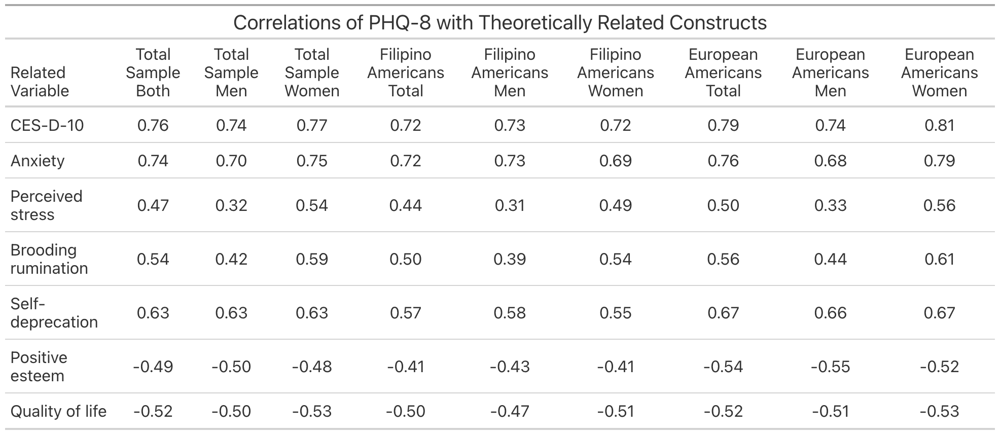

```

## 8. Session Information

```{r}
#| label: session-information
#| echo: false
#| message: false
#| warning: false

cat("Quarto version:", system2("quarto", "--version", stdout = TRUE), "\n\n")
sessionInfo()
```

### References for Software and Analytic Framework

Rosseel, Y. (2012). lavaan: An R package for structural equation modeling. *Journal of Statistical Software, 48*(2), 1–36.\
R Core Team. (2026). *R: A language and environment for statistical computing.*\
Posit Software, PBC. (2026). *RStudio Pro.*\
Quarto Project. (2024). *Quarto Documentation and Authoring System.*
